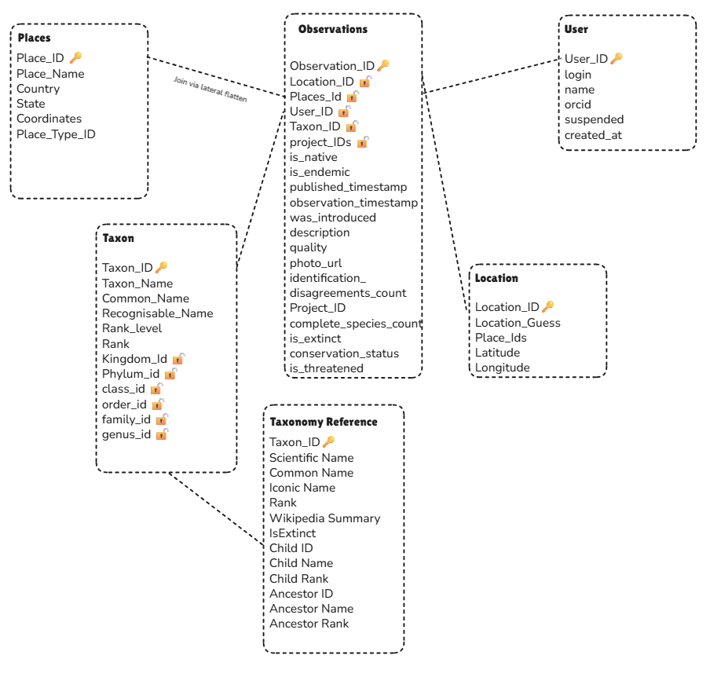

# 🌵 iNaturalist Python Tool

This is a Python Project utilising the iNaturalist API and going through biodiversity observations in National Parks and additional Locations to publish them to a Snowflake Server. You can utilise some of the Python Scripts and edit them to retrieve data from your favorite locations! 

---

## 🦆 Contents 

- [About iNaturalist API](#-about-inaturalist-api)  
- [Installation](#-installation)  
- [Usage](#-usage)  
  - [1. main](#-main)  
  - [2. get_park_ids](#-get_park_ids)  
  - [3. get_places](#-get_places)  
  - [4. taxon](#-taxon)  
  - [5. push_to_stage](#-push_to_stage)  
  - [6. set_up_logs](#-set_up_logs)  
  - [7. remove_local_data](#-remove_local_data)  
  - [8. Snowflake Scripts](#-Snowflake Scripts)  
- [Repository Structure](#-repository-structure)  

---

## 🦊 About iNaturalist API

[iNaturalist](https://www.inaturalist.org/) is a global community where users can record observations of plants, animals, fungi, and other organisms. The iNaturalist API provides access to this data, enabling developers and researchers to:

- Query species observations
- Retrieve geographic locations and places
- Access taxonomic information
- Analyze biodiversity data for research or conservation projects

This repository provides Python scripts and utilities to simplify these interactions with the API.

Here's a link to the API documentation: https://www.inaturalist.org/pages/api+reference

---

## 🐼 Installation

1. **Clone the repository**

    git clone https://github.com/julesclaeys/inaturalist.git  
    cd inaturalist  

2. **Create and activate a virtual environment**

    python3 -m venv venv  
    venv\Scripts\activate      # Windows  

3. **Install dependencies**
    
All the required packages should be in the requirements.txt file!
   
    pip install -r requirements.txt 

These steps should allow you to use the scripts on your machine. Any script connecting to snowflake (Taxon.py, push_to_stage.py) require you to put your own snowflake account details. 

## 🐘 Usage

Each script serves a specific purpose when working with iNaturalist data: 

---

### 🐒 main

This is how I use the different functions. Only parameters to input are Days_Back decides how many days, in addition to today, the script will search data for and the list of places you want to obtain observations for. 0 Means just today and is the default value. Removing the get_taxon() and push_to_stage() will allow a user to run the script without Snowflake. 

---

### 🐯 get_park_ids

This function takes a list of strings, these are the locations we want to obtain the IDs for. This will use the API's Get places autocomplete function to find the IDs related to each of the places. If the API does not find a location for the string, they will be sent into the logs into the warning folder. If it cannot find your location, it is worth trying different spellings, certain characters are not recognised. 

Example result from the logs:  

Channel Islands National Park:3157
Park Not Found, Indiana Dunes National Park.

The function outputs a list of IDs. This list is used in both get_places and get_observations.  

---

### 🐩 get_places

This script takes the places_ids from fetch_park_id() and finds details for those places, all of the json data from the API is stored in a single file refreshed everytime you run the script, be careful not to run it without certain values as this will remove them from the file. For example we looked at the Channel Islands National Park with ID 3157 this is the output:

 Json Preview 

    {
    total_results: 1,
    page: 1,
    per_page: 1,
    results: [
    {
    id: 3157,
    uuid: "9c862ad3-b0a8-4cea-83b2-c5b27b5b08fc",
    slug: "channel-islands-national-park-5a332df3-9311-4821-8607-21c0aae429c9",
    name: "Channel Islands National Park",
    display_name: "Channel Islands National Park, US, CA",
    place_type: 100,
    admin_level: 100,
    bbox_area: 1.173658828440996,
    ancestor_place_ids: [
    97394,
    1,
    14,
    3157
    ],
    geometry_geojson: {
    type: "MultiPolygon",
    coordinates: [
    [
    [
    [
    -119.0357655579341,
    33.44808815714276
    ],
    [
    -119.05664041981947,
    33.45726749230096
    ],
    [
    -119.06751530618641,
    33.486404710009424
    ],
    [
    -119.02463611396547,
    33.505129300077215
    ],
    [
    -119.00800106359816,
    33.473128824435776
    ],
    [
    -119.0357655579341,
    33.44808815714276
    ]
    ]
    ],
    [
    [
    [
    -120.47299511543218,
    34.02916202600676
    ],
    [
    -120.46125168991352,
    34.05076421459688
    ],
    [
    -120.36926857238666,
    34.09328289199192
    ],
    [
    -120.28659051703869,
    34.02907767499477
    ],
    [
    -120.30151107917294,
    34.004547712007366
    ],
    [
    -120.36040165541203,
    33.99706888242304
    ],
    [
    -120.45779649641116,
    34.01294882962486
    ],
    [
    -120.47299511543218,
    34.02916202600676
    ]
    ]
    ],
    [
    [
    [
    -119.26681654874471,
    34.248063913418946
    ],
    [
    -119.26712563763806,
    34.24922371600172
    ],
    [
    -119.26560925116598,
    34.248743868334884
    ],
    [
    -119.26681654874471,
    34.248063913418946
    ]
    ]
    ],
    [
    [
    [
    -120.2707290625961,
    34.00085216119834
    ],
    [
    -120.24345605585228,
    34.02531391060853
    ],
    [
    -120.17942085298995,
    34.02380484641657
    ],
    [
    -120.15186665881919,
    34.04070052840672
    ],
    [
    -120.09466432769653,
    34.03680999558486
    ],
    [
    -120.04169872341731,
    34.05300513897606
    ],
    [
    -120.0237876870521,
    34.04075394004235
    ],
    [
    -120.02578956083954,
    34.00564635889242
    ],
    [
    -119.96257794541583,
    33.99260314142191
    ],
    [
    -119.9481422437695,
    33.93981969842042
    ],
    [
    -120.12424955257478,
    33.87816663867949
    ],
    [
    -120.19462625199992,
    33.913232622587486
    ],
    [
    -120.2707290625961,
    34.00085216119834
    ]
    ]
    ],
    [
    [
    [
    -119.33974526063525,
    34.02377191414257
    ],
    [
    -119.34434997657013,
    34.00281573555782
    ],
    [
    -119.39023965113898,
    33.98581121041906
    ],
    [
    -119.44640774841884,
    33.99499096106405
    ],
    [
    -119.46389835082817,
    34.012284477946366
    ],
    [
    -119.43562677015927,
    34.03285153157299
    ],
    [
    -119.33974526063525,
    34.02377191414257
    ]
    ]
    ],
    [
    [
    [
    -119.94995670333918,
    34.05934861404734
    ],
    [
    -119.93390100702584,
    34.08878685642833
    ],
    [
    -119.91231031896604,
    34.09447816833284
    ],
    [
    -119.80995422580685,
    34.07042624537496
    ],
    [
    -119.7537975634068,
    34.075171036114455
    ],
    [
    -119.63289991379997,
    34.03164563693667
    ],
    [
    -119.60672029290714,
    34.06268444413183
    ],
    [
    -119.55976357902591,
    34.07222472758917
    ],
    [
    -119.5003938907654,
    34.033285881638164
    ],
    [
    -119.55280951824466,
    33.9799997248075
    ],
    [
    -119.6496791245919,
    33.97079650095782
    ],
    [
    -119.71794162760398,
    33.94290336309979
    ],
    [
    -119.81900182197649,
    33.94319773458784
    ],
    [
    -119.8889514936165,
    33.96883965712453
    ],
    [
    -119.90719268369537,
    34.00490447486169
    ],
    [
    -119.89941149844185,
    34.024252084666045
    ],
    [
    -119.94995670333918,
    34.05934861404734
    ]
    ]
    ]
    ]
    },
    bounding_box_geojson: {
    type: "Polygon",
    coordinates: [
    [
    [
    -120.4729951154,
    33.4480881571
    ],
    [
    -120.4729951154,
    34.249223716
    ],
    [
    -119.0080010636,
    34.249223716
    ],
    [
    -119.0080010636,
    33.4480881571
    ],
    [
    -120.4729951154,
    33.4480881571
    ]
    ]
    ]
    },
    location: "33.9867131515,-119.9113246962"
    }
    ]
    }

---

### 🌺 get_observations

Using the list of Park_ids and the number of days to search for, this returns details for the observations, the species observed, information about its taxonomy and the user. There's also a list of different identifications suggested by users. Here is an example observations: 

 Json Preview 
 

    {
    quality_grade: "research",
    time_observed_at: "2025-12-28T13:00:26-08:00",
    taxon_geoprivacy: null,
    annotations: [ ],
    uuid: "cfc43b83-2433-47ae-98fb-b1543ddeb5bb",
    observed_on_details: {
    date: "2025-12-28",
    day: 28,
    month: 12,
    year: 2025,
    hour: 13,
    week: 52
    },
    id: 335643840,
    cached_votes_total: 0,
    identifications_most_agree: true,
    created_at_details: {
    date: "2026-01-21",
    day: 21,
    month: 1,
    year: 2026,
    hour: 14,
    week: 4
    },
    species_guess: "Pacific Purple Sea Urchin",
    identifications_most_disagree: false,
    tags: [ ],
    positional_accuracy: 4,
    comments_count: 0,
    site_id: 1,
    created_time_zone: "America/Los_Angeles",
    license_code: "cc-by",
    observed_time_zone: "America/Los_Angeles",
    quality_metrics: [ ],
    public_positional_accuracy: 4,
    reviewed_by: [
    329215,
    882633
    ],
    oauth_application_id: 843,
    flags: [ ],
    created_at: "2026-01-21T14:07:32-08:00",
    description: null,
    time_zone_offset: "-08:00",
    project_ids_with_curator_id: [ ],
    observed_on: "2025-12-28",
    observed_on_string: "2025-12-28 13:00:26",
    updated_at: "2026-01-21T14:28:48-08:00",
    sounds: [ ],
    place_ids: [
    1,
    14,
    1531,
    3157,
    9853,
    51727,
    52322,
    55105,
    59613,
    62068,
    66741,
    69118,
    77313,
    81264,
    92151,
    92337,
    95504,
    96034,
    96683,
    96687,
    97394,
    118386,
    118414,
    121884,
    125185,
    125311,
    133884,
    141005,
    141006,
    145770,
    165792
    ],
    captive: false,
    taxon: {
    provisional: false,
    is_active: true,
    ancestry: "48460/1/47549/774753/47548/475988/552153/774993/85508/814155/814173/48037/48036",
    min_species_ancestry: "48460,1,47549,774753,47548,475988,552153,774993,85508,814155,814173,48037,48036,48035",
    endemic: false,
    iconic_taxon_id: 1,
    min_species_taxon_id: 48035,
    threatened: false,
    rank_level: 10,
    introduced: false,
    native: true,
    parent_id: 48036,
    name: "Strongylocentrotus purpuratus",
    rank: "species",
    extinct: false,
    id: 48035,
    ancestor_ids: [
    48460,
    1,
    47549,
    774753,
    47548,
    475988,
    552153,
    774993,
    85508,
    814155,
    814173,
    48037,
    48036,
    48035
    ],
    created_at: "2008-08-01T19:35:24+00:00",
    default_photo: {
    id: 338665145,
    license_code: "cc-by-nc",
    attribution: "(c) Dave, some rights reserved (CC BY-NC), uploaded by Dave",
    url: "https://inaturalist-open-data.s3.amazonaws.com/photos/338665145/square.jpeg",
    original_dimensions: {
    height: 1536,
    width: 2048
    },
    flags: [ ],
    attribution_name: "Dave",
    square_url: "https://inaturalist-open-data.s3.amazonaws.com/photos/338665145/square.jpeg",
    medium_url: "https://inaturalist-open-data.s3.amazonaws.com/photos/338665145/medium.jpeg"
    },
    taxon_changes_count: 0,
    taxon_schemes_count: 2,
    observations_count: 17690,
    photos_locked: false,
    universal_search_rank: 17690,
    flag_counts: {
    resolved: 0,
    unresolved: 0
    },
    current_synonymous_taxon_ids: null,
    atlas_id: 3957,
    complete_species_count: null,
    wikipedia_url: "http://en.wikipedia.org/wiki/Strongylocentrotus_purpuratus",
    iconic_taxon_name: "Animalia",
    preferred_common_name: "Pacific Purple Sea Urchin"
    },
    ident_taxon_ids: [
    48460,
    1,
    47549,
    774753,
    47548,
    475988,
    552153,
    774993,
    85508,
    814155,
    814173,
    48037,
    48036,
    48035
    ],
    outlinks: [ ],
    faves_count: 0,
    ofvs: [ ],
    num_identification_agreements: 1,
    preferences: {
    prefers_community_taxon: null
    },
    identification_disagreements_count: 0,
    comments: [ ],
    map_scale: null,
    uri: "https://www.inaturalist.org/observations/335643840",
    project_ids: [ ],
    community_taxon_id: 48035,
    geojson: {
    type: "Point",
    coordinates: [
    -119.6838569733,
    34.019310906
    ]
    },
    owners_identification_from_vision: true,
    identifications_count: 1,
    obscured: false,
    num_identification_disagreements: 0,
    geoprivacy: null,
    location: "34.019310906,-119.6838569733",
    votes: [ ],
    spam: false,
    user: {
    id: 882633,
    login: "captainsquid",
    spam: false,
    suspended: false,
    created_at: "2018-04-23T05:29:08+00:00",
    site_id: 1,
    preferences: { },
    login_autocomplete: "captainsquid",
    login_exact: "captainsquid",
    name: null,
    name_autocomplete: null,
    orcid: null,
    icon: null,
    observations_count: 151,
    identifications_count: 0,
    journal_posts_count: 0,
    activity_count: 151,
    species_count: 131,
    annotated_observations_count: 7,
    universal_search_rank: 151,
    roles: [ ],
    icon_url: null
    },
    mappable: true,
    identifications_some_agree: true,
    project_ids_without_curator_id: [ ],
    place_guess: "Channel Islands National Park, Channel Islands, Santa Barbara County, US-CA, US",
    identifications: [
    {
    id: 753021766,
    uuid: "43c73195-d49a-4f54-a491-31489994842c",
    user: {
    id: 882633,
    login: "captainsquid",
    spam: false,
    suspended: false,
    created_at: "2018-04-23T05:29:08+00:00",
    login_autocomplete: "captainsquid",
    login_exact: "captainsquid",
    name: null,
    name_autocomplete: null,
    orcid: null,
    icon: null,
    observations_count: 151,
    identifications_count: 0,
    journal_posts_count: 0,
    activity_count: 151,
    species_count: 131,
    annotated_observations_count: 7,
    universal_search_rank: 151,
    roles: [ ],
    site_id: 1,
    icon_url: null
    },
    created_at: "2026-01-21T16:07:32-06:00",
    created_at_details: {
    date: "2026-01-21",
    day: 21,
    month: 1,
    year: 2026,
    hour: 16,
    week: 4
    },
    body: null,
    category: "improving",
    current: true,
    flags: [ ],
    own_observation: true,
    taxon_change: null,
    vision: true,
    disagreement: null,
    previous_observation_taxon_id: 48035,
    spam: false,
    taxon_id: 48035,
    hidden: false,
    moderator_actions: [ ],
    taxon: {
    id: 48035,
    rank: "species",
    rank_level: 10,
    iconic_taxon_id: 1,
    ancestor_ids: [
    48460,
    1,
    47549,
    774753,
    47548,
    475988,
    552153,
    774993,
    85508,
    814155,
    814173,
    48037,
    48036
    ],
    is_active: true,
    min_species_taxon_id: 48035,
    name: "Strongylocentrotus purpuratus",
    parent_id: 48036,
    ancestry: "48460/1/47549/774753/47548/475988/552153/774993/85508/814155/814173/48037/48036",
    min_species_ancestry: "48460,1,47549,774753,47548,475988,552153,774993,85508,814155,814173,48037,48036,48035",
    extinct: false,
    provisional: false,
    created_at: "2008-08-01T19:35:24+00:00",
    default_photo: {
    id: 338665145,
    license_code: "cc-by-nc",
    attribution: "(c) Dave, some rights reserved (CC BY-NC), uploaded by Dave",
    url: "https://inaturalist-open-data.s3.amazonaws.com/photos/338665145/square.jpeg",
    original_dimensions: {
    height: 1536,
    width: 2048
    },
    flags: [ ],
    attribution_name: "Dave",
    square_url: "https://inaturalist-open-data.s3.amazonaws.com/photos/338665145/square.jpeg",
    medium_url: "https://inaturalist-open-data.s3.amazonaws.com/photos/338665145/medium.jpeg"
    },
    taxon_changes_count: 0,
    taxon_schemes_count: 2,
    observations_count: 17690,
    photos_locked: false,
    universal_search_rank: 17690,
    flag_counts: {
    resolved: 0,
    unresolved: 0
    },
    current_synonymous_taxon_ids: null,
    atlas_id: 3957,
    complete_species_count: null,
    wikipedia_url: "http://en.wikipedia.org/wiki/Strongylocentrotus_purpuratus",
    iconic_taxon_name: "Animalia",
    preferred_common_name: "Pacific Purple Sea Urchin",
    ancestors: [
    {
    id: 1,
    rank: "kingdom",
    rank_level: 70,
    iconic_taxon_id: 1,
    ancestor_ids: [
    48460,
    1
    ],
    is_active: true,
    name: "Animalia",
    parent_id: 48460,
    ancestry: "48460",
    extinct: false,
    provisional: false,
    default_photo: {
    id: 80678745,
    license_code: "cc0",
    attribution: "no rights reserved, uploaded by Abhas Misraraj",
    url: "https://inaturalist-open-data.s3.amazonaws.com/photos/80678745/square.jpg",
    original_dimensions: {
    height: 2000,
    width: 2000
    },
    flags: [ ],
    attribution_name: "Abhas Misraraj",
    square_url: "https://inaturalist-open-data.s3.amazonaws.com/photos/80678745/square.jpg",
    medium_url: "https://inaturalist-open-data.s3.amazonaws.com/photos/80678745/medium.jpg"
    },
    taxon_changes_count: 7,
    taxon_schemes_count: 2,
    observations_count: 166108022,
    flag_counts: {
    resolved: 16,
    unresolved: 1
    },
    current_synonymous_taxon_ids: null,
    atlas_id: null,
    complete_species_count: null,
    wikipedia_url: "http://en.wikipedia.org/wiki/Animal",
    complete_rank: "order",
    iconic_taxon_name: "Animalia",
    preferred_common_name: "Animals"
    },
    {
    id: 47549,
    rank: "phylum",
    rank_level: 60,
    iconic_taxon_id: 1,
    ancestor_ids: [
    48460,
    1,
    47549
    ],
    is_active: true,
    name: "Echinodermata",
    parent_id: 1,
    ancestry: "48460/1",
    extinct: false,
    provisional: false,
    default_photo: {
    id: 22930217,
    license_code: null,
    attribution: "(c) Lesley Clements, all rights reserved",
    url: "https://static.inaturalist.org/photos/22930217/square.jpg",
    original_dimensions: {
    height: 1425,
    width: 2048
    },
    flags: [ ],
    attribution_name: "Lesley Clements",
    square_url: "https://static.inaturalist.org/photos/22930217/square.jpg",
    medium_url: "https://static.inaturalist.org/photos/22930217/medium.jpg"
    },
    taxon_changes_count: 0,
    taxon_schemes_count: 2,
    observations_count: 591604,
    flag_counts: {
    resolved: 0,
    unresolved: 0
    },
    current_synonymous_taxon_ids: null,
    atlas_id: null,
    complete_species_count: null,
    wikipedia_url: "http://en.wikipedia.org/wiki/Echinoderm",
    complete_rank: "order",
    iconic_taxon_name: "Animalia",
    preferred_common_name: "Echinoderms"
    },
    {
    id: 774753,
    rank: "subphylum",
    rank_level: 57,
    iconic_taxon_id: 1,
    ancestor_ids: [
    48460,
    1,
    47549,
    774753
    ],
    is_active: true,
    name: "Echinozoa",
    parent_id: 47549,
    ancestry: "48460/1/47549",
    extinct: false,
    provisional: false,
    default_photo: {
    id: 65472908,
    license_code: "cc-by",
    attribution: "(c) Erin McKittrick, some rights reserved (CC BY), uploaded by Erin McKittrick",
    url: "https://inaturalist-open-data.s3.amazonaws.com/photos/65472908/square.jpeg",
    original_dimensions: {
    height: 2027,
    width: 2048
    },
    flags: [ ],
    attribution_name: "Erin McKittrick",
    square_url: "https://inaturalist-open-data.s3.amazonaws.com/photos/65472908/square.jpeg",
    medium_url: "https://inaturalist-open-data.s3.amazonaws.com/photos/65472908/medium.jpeg"
    },
    taxon_changes_count: 0,
    taxon_schemes_count: 0,
    observations_count: 234908,
    flag_counts: {
    resolved: 0,
    unresolved: 0
    },
    current_synonymous_taxon_ids: null,
    atlas_id: null,
    complete_species_count: null,
    wikipedia_url: "http://en.wikipedia.org/wiki/Echinozoa",
    iconic_taxon_name: "Animalia",
    preferred_common_name: "sea urchins and sea cucumbers"
    },
    {
    id: 47548,
    rank: "class",
    rank_level: 50,
    iconic_taxon_id: 1,
    ancestor_ids: [
    48460,
    1,
    47549,
    774753,
    47548
    ],
    is_active: true,
    name: "Echinoidea",
    parent_id: 774753,
    ancestry: "48460/1/47549/774753",
    extinct: false,
    provisional: false,
    default_photo: {
    id: 4108,
    license_code: "cc-by-nc-sa",
    attribution: "(c) cassimano, some rights reserved (CC BY-NC-SA)",
    url: "https://inaturalist-open-data.s3.amazonaws.com/photos/4108/square.jpg",
    original_dimensions: {
    height: 768,
    width: 1024
    },
    flags: [ ],
    attribution_name: "cassimano",
    square_url: "https://inaturalist-open-data.s3.amazonaws.com/photos/4108/square.jpg",
    medium_url: "https://inaturalist-open-data.s3.amazonaws.com/photos/4108/medium.jpg"
    },
    taxon_changes_count: 0,
    taxon_schemes_count: 2,
    observations_count: 153276,
    flag_counts: {
    resolved: 2,
    unresolved: 0
    },
    current_synonymous_taxon_ids: null,
    atlas_id: null,
    complete_species_count: null,
    wikipedia_url: "http://en.wikipedia.org/wiki/Sea_urchin",
    iconic_taxon_name: "Animalia",
    preferred_common_name: "Sea Urchins, Sand Dollars, and Heart Urchins"
    },
    {
    id: 475988,
    rank: "subclass",
    rank_level: 47,
    iconic_taxon_id: 1,
    ancestor_ids: [
    48460,
    1,
    47549,
    774753,
    47548,
    475988
    ],
    is_active: true,
    name: "Euechinoidea",
    parent_id: 47548,
    ancestry: "48460/1/47549/774753/47548",
    extinct: false,
    provisional: false,
    default_photo: {
    id: 142070110,
    license_code: "cc-by-sa",
    attribution: "(c) FredD, some rights reserved (CC BY-SA)",
    url: "https://inaturalist-open-data.s3.amazonaws.com/photos/142070110/square.jpeg",
    original_dimensions: {
    height: 1536,
    width: 2048
    },
    flags: [ ],
    attribution_name: "FredD",
    square_url: "https://inaturalist-open-data.s3.amazonaws.com/photos/142070110/square.jpeg",
    medium_url: "https://inaturalist-open-data.s3.amazonaws.com/photos/142070110/medium.jpeg"
    },
    taxon_changes_count: 0,
    taxon_schemes_count: 1,
    observations_count: 146127,
    flag_counts: {
    resolved: 0,
    unresolved: 0
    },
    current_synonymous_taxon_ids: null,
    atlas_id: null,
    complete_species_count: null,
    wikipedia_url: "http://en.wikipedia.org/wiki/Euechinoidea",
    iconic_taxon_name: "Animalia",
    preferred_common_name: "sea urchins"
    },
    {
    id: 552153,
    rank: "infraclass",
    rank_level: 45,
    iconic_taxon_id: 1,
    ancestor_ids: [
    48460,
    1,
    47549,
    774753,
    47548,
    475988,
    552153
    ],
    is_active: true,
    name: "Carinacea",
    parent_id: 475988,
    ancestry: "48460/1/47549/774753/47548/475988",
    extinct: false,
    provisional: false,
    default_photo: {
    id: 9023511,
    license_code: "cc-by-nc-sa",
    attribution: "(c) Shirley Parker-Nance, some rights reserved (CC BY-NC-SA)",
    url: "https://inaturalist-open-data.s3.amazonaws.com/photos/9023511/square.jpg",
    original_dimensions: {
    height: 600,
    width: 800
    },
    flags: [ ],
    attribution_name: "Shirley Parker-Nance",
    square_url: "https://inaturalist-open-data.s3.amazonaws.com/photos/9023511/square.jpg",
    medium_url: "https://inaturalist-open-data.s3.amazonaws.com/photos/9023511/medium.jpg"
    },
    taxon_changes_count: 0,
    taxon_schemes_count: 0,
    observations_count: 95236,
    flag_counts: {
    resolved: 0,
    unresolved: 0
    },
    current_synonymous_taxon_ids: null,
    atlas_id: null,
    complete_species_count: null,
    wikipedia_url: "http://en.wikipedia.org/wiki/Carinacea",
    iconic_taxon_name: "Animalia"
    },
    {
    id: 774993,
    rank: "subterclass",
    rank_level: 44,
    iconic_taxon_id: 1,
    ancestor_ids: [
    48460,
    1,
    47549,
    774753,
    47548,
    475988,
    552153,
    774993
    ],
    is_active: true,
    name: "Echinacea",
    parent_id: 552153,
    ancestry: "48460/1/47549/774753/47548/475988/552153",
    extinct: false,
    provisional: false,
    default_photo: {
    id: 2951438,
    license_code: "cc-by-nc",
    attribution: "(c) sortor, some rights reserved (CC BY-NC)",
    url: "https://inaturalist-open-data.s3.amazonaws.com/photos/2951438/square.jpg",
    original_dimensions: {
    height: 1200,
    width: 1600
    },
    flags: [ ],
    attribution_name: "sortor",
    square_url: "https://inaturalist-open-data.s3.amazonaws.com/photos/2951438/square.jpg",
    medium_url: "https://inaturalist-open-data.s3.amazonaws.com/photos/2951438/medium.jpg"
    },
    taxon_changes_count: 1,
    taxon_schemes_count: 1,
    observations_count: 95212,
    flag_counts: {
    resolved: 2,
    unresolved: 0
    },
    current_synonymous_taxon_ids: null,
    atlas_id: null,
    complete_species_count: null,
    wikipedia_url: "http://en.wikipedia.org/wiki/Echinacea_(animal)",
    iconic_taxon_name: "Animalia"
    },
    {
    id: 85508,
    rank: "order",
    rank_level: 40,
    iconic_taxon_id: 1,
    ancestor_ids: [
    48460,
    1,
    47549,
    774753,
    47548,
    475988,
    552153,
    774993,
    85508
    ],
    is_active: true,
    name: "Camarodonta",
    parent_id: 774993,
    ancestry: "48460/1/47549/774753/47548/475988/552153/774993",
    extinct: false,
    provisional: false,
    default_photo: {
    id: 220259,
    license_code: "cc-by-nc-sa",
    attribution: "(c) Martin Hingston, some rights reserved (CC BY-NC-SA)",
    url: "https://inaturalist-open-data.s3.amazonaws.com/photos/220259/square.jpg",
    original_dimensions: {
    height: 375,
    width: 500
    },
    flags: [ ],
    attribution_name: "Martin Hingston",
    square_url: "https://inaturalist-open-data.s3.amazonaws.com/photos/220259/square.jpg",
    medium_url: "https://inaturalist-open-data.s3.amazonaws.com/photos/220259/medium.jpg"
    },
    taxon_changes_count: 0,
    taxon_schemes_count: 1,
    observations_count: 86791,
    flag_counts: {
    resolved: 0,
    unresolved: 0
    },
    current_synonymous_taxon_ids: null,
    atlas_id: null,
    complete_species_count: null,
    wikipedia_url: "http://en.wikipedia.org/wiki/Camarodonta",
    iconic_taxon_name: "Animalia"
    },
    {
    id: 814155,
    rank: "infraorder",
    rank_level: 35,
    iconic_taxon_id: 1,
    ancestor_ids: [
    48460,
    1,
    47549,
    774753,
    47548,
    475988,
    552153,
    774993,
    85508,
    814155
    ],
    is_active: true,
    name: "Echinidea",
    parent_id: 85508,
    ancestry: "48460/1/47549/774753/47548/475988/552153/774993/85508",
    extinct: false,
    provisional: false,
    default_photo: {
    id: 20838549,
    license_code: "cc-by-nc",
    attribution: "(c) Damon Tighe, some rights reserved (CC BY-NC), uploaded by Damon Tighe",
    url: "https://inaturalist-open-data.s3.amazonaws.com/photos/20838549/square.jpeg",
    original_dimensions: {
    height: 2048,
    width: 1536
    },
    flags: [ ],
    attribution_name: "Damon Tighe",
    square_url: "https://inaturalist-open-data.s3.amazonaws.com/photos/20838549/square.jpeg",
    medium_url: "https://inaturalist-open-data.s3.amazonaws.com/photos/20838549/medium.jpeg"
    },
    taxon_changes_count: 0,
    taxon_schemes_count: 0,
    observations_count: 81444,
    flag_counts: {
    resolved: 0,
    unresolved: 0
    },
    current_synonymous_taxon_ids: null,
    atlas_id: null,
    complete_species_count: null,
    wikipedia_url: "https://en.wikipedia.org/wiki/Camarodonta",
    iconic_taxon_name: "Animalia"
    },
    {
    id: 814173,
    rank: "superfamily",
    rank_level: 33,
    iconic_taxon_id: 1,
    ancestor_ids: [
    48460,
    1,
    47549,
    774753,
    47548,
    475988,
    552153,
    774993,
    85508,
    814155,
    814173
    ],
    is_active: true,
    name: "Odontophora",
    parent_id: 814155,
    ancestry: "48460/1/47549/774753/47548/475988/552153/774993/85508/814155",
    extinct: false,
    provisional: false,
    default_photo: {
    id: 3218,
    license_code: "cc-by",
    attribution: "(c) Ken-ichi Ueda, some rights reserved (CC BY)",
    url: "https://inaturalist-open-data.s3.amazonaws.com/photos/3218/square.jpg",
    original_dimensions: {
    height: 2011,
    width: 2011
    },
    flags: [ ],
    attribution_name: "Ken-ichi Ueda",
    square_url: "https://inaturalist-open-data.s3.amazonaws.com/photos/3218/square.jpg",
    medium_url: "https://inaturalist-open-data.s3.amazonaws.com/photos/3218/medium.jpg"
    },
    taxon_changes_count: 0,
    taxon_schemes_count: 1,
    observations_count: 69943,
    flag_counts: {
    resolved: 0,
    unresolved: 0
    },
    current_synonymous_taxon_ids: null,
    atlas_id: null,
    complete_species_count: null,
    wikipedia_url: null,
    iconic_taxon_name: "Animalia"
    },
    {
    id: 48037,
    rank: "family",
    rank_level: 30,
    iconic_taxon_id: 1,
    ancestor_ids: [
    48460,
    1,
    47549,
    774753,
    47548,
    475988,
    552153,
    774993,
    85508,
    814155,
    814173,
    48037
    ],
    is_active: true,
    name: "Strongylocentrotidae",
    parent_id: 814173,
    ancestry: "48460/1/47549/774753/47548/475988/552153/774993/85508/814155/814173",
    extinct: false,
    provisional: false,
    default_photo: {
    id: 387656391,
    license_code: "cc-by-nc",
    attribution: "(c) Laura, some rights reserved (CC BY-NC), uploaded by Laura",
    url: "https://inaturalist-open-data.s3.amazonaws.com/photos/387656391/square.jpg",
    original_dimensions: {
    height: 2048,
    width: 1536
    },
    flags: [ ],
    attribution_name: "Laura",
    square_url: "https://inaturalist-open-data.s3.amazonaws.com/photos/387656391/square.jpg",
    medium_url: "https://inaturalist-open-data.s3.amazonaws.com/photos/387656391/medium.jpg"
    },
    taxon_changes_count: 0,
    taxon_schemes_count: 1,
    observations_count: 31122,
    flag_counts: {
    resolved: 0,
    unresolved: 0
    },
    current_synonymous_taxon_ids: null,
    atlas_id: null,
    complete_species_count: null,
    wikipedia_url: "http://en.wikipedia.org/wiki/Strongylocentrotidae",
    iconic_taxon_name: "Animalia"
    },
    {
    id: 48036,
    rank: "genus",
    rank_level: 20,
    iconic_taxon_id: 1,
    ancestor_ids: [
    48460,
    1,
    47549,
    774753,
    47548,
    475988,
    552153,
    774993,
    85508,
    814155,
    814173,
    48037,
    48036
    ],
    is_active: true,
    name: "Strongylocentrotus",
    parent_id: 48037,
    ancestry: "48460/1/47549/774753/47548/475988/552153/774993/85508/814155/814173/48037",
    extinct: false,
    provisional: false,
    default_photo: {
    id: 30559183,
    license_code: "cc-by-nc",
    attribution: "(c) Robin Gwen Agarwal, some rights reserved (CC BY-NC), uploaded by Robin Gwen Agarwal",
    url: "https://inaturalist-open-data.s3.amazonaws.com/photos/30559183/square.jpg",
    original_dimensions: {
    height: 2048,
    width: 1731
    },
    flags: [ ],
    attribution_name: "Robin Gwen Agarwal",
    square_url: "https://inaturalist-open-data.s3.amazonaws.com/photos/30559183/square.jpg",
    medium_url: "https://inaturalist-open-data.s3.amazonaws.com/photos/30559183/medium.jpg"
    },
    taxon_changes_count: 0,
    taxon_schemes_count: 1,
    observations_count: 25914,
    flag_counts: {
    resolved: 0,
    unresolved: 0
    },
    current_synonymous_taxon_ids: null,
    atlas_id: null,
    complete_species_count: null,
    wikipedia_url: "http://en.wikipedia.org/wiki/Strongylocentrotus",
    iconic_taxon_name: "Animalia"
    }
    ]
    },
    previous_observation_taxon: {
    id: 48035,
    rank: "species",
    rank_level: 10,
    iconic_taxon_id: 1,
    ancestor_ids: [
    48460,
    1,
    47549,
    774753,
    47548,
    475988,
    552153,
    774993,
    85508,
    814155,
    814173,
    48037,
    48036,
    48035
    ],
    is_active: true,
    min_species_taxon_id: 48035,
    name: "Strongylocentrotus purpuratus",
    parent_id: 48036,
    ancestry: "48460/1/47549/774753/47548/475988/552153/774993/85508/814155/814173/48037/48036",
    min_species_ancestry: "48460,1,47549,774753,47548,475988,552153,774993,85508,814155,814173,48037,48036,48035",
    extinct: false,
    provisional: false,
    created_at: "2008-08-01T19:35:24+00:00",
    default_photo: {
    id: 338665145,
    license_code: "cc-by-nc",
    attribution: "(c) Dave, some rights reserved (CC BY-NC), uploaded by Dave",
    url: "https://inaturalist-open-data.s3.amazonaws.com/photos/338665145/square.jpeg",
    original_dimensions: {
    height: 1536,
    width: 2048
    },
    flags: [ ],
    attribution_name: "Dave",
    square_url: "https://inaturalist-open-data.s3.amazonaws.com/photos/338665145/square.jpeg",
    medium_url: "https://inaturalist-open-data.s3.amazonaws.com/photos/338665145/medium.jpeg"
    },
    taxon_changes_count: 0,
    taxon_schemes_count: 2,
    observations_count: 17690,
    photos_locked: false,
    universal_search_rank: 17690,
    flag_counts: {
    resolved: 0,
    unresolved: 0
    },
    current_synonymous_taxon_ids: null,
    atlas_id: 3957,
    complete_species_count: null,
    wikipedia_url: "http://en.wikipedia.org/wiki/Strongylocentrotus_purpuratus",
    iconic_taxon_name: "Animalia",
    preferred_common_name: "Pacific Purple Sea Urchin"
    }
    },
    {
    id: 753028197,
    uuid: "ee3b3ab8-dca9-4407-b4b8-d846a1cd70b5",
    user: {
    id: 329215,
    login: "andreacaballero",
    spam: false,
    suspended: false,
    created_at: "2016-09-14T21:41:39+00:00",
    login_autocomplete: "andreacaballero",
    login_exact: "andreacaballero",
    name: "Andrea Caballero",
    name_autocomplete: "Andrea Caballero",
    orcid: "https://orcid.org/0000-0001-5520-3823",
    icon: "https://static.inaturalist.org/attachments/users/icons/329215/thumb.jpg?1475536518",
    observations_count: 535,
    identifications_count: 29438,
    journal_posts_count: 0,
    activity_count: 29973,
    species_count: 341,
    annotated_observations_count: 3,
    universal_search_rank: 535,
    roles: [ ],
    site_id: 2,
    icon_url: "https://static.inaturalist.org/attachments/users/icons/329215/medium.jpg?1475536518"
    },
    created_at: "2026-01-21T16:28:48-06:00",
    created_at_details: {
    date: "2026-01-21",
    day: 21,
    month: 1,
    year: 2026,
    hour: 16,
    week: 4
    },
    body: null,
    category: "supporting",
    current: true,
    flags: [ ],
    own_observation: false,
    taxon_change: null,
    vision: false,
    disagreement: false,
    previous_observation_taxon_id: 48035,
    spam: false,
    taxon_id: 48035,
    hidden: false,
    moderator_actions: [ ],
    taxon: {
    id: 48035,
    rank: "species",
    rank_level: 10,
    iconic_taxon_id: 1,
    ancestor_ids: [
    48460,
    1,
    47549,
    774753,
    47548,
    475988,
    552153,
    774993,
    85508,
    814155,
    814173,
    48037,
    48036
    ],
    is_active: true,
    min_species_taxon_id: 48035,
    name: "Strongylocentrotus purpuratus",
    parent_id: 48036,
    ancestry: "48460/1/47549/774753/47548/475988/552153/774993/85508/814155/814173/48037/48036",
    min_species_ancestry: "48460,1,47549,774753,47548,475988,552153,774993,85508,814155,814173,48037,48036,48035",
    extinct: false,
    provisional: false,
    created_at: "2008-08-01T19:35:24+00:00",
    default_photo: {
    id: 338665145,
    license_code: "cc-by-nc",
    attribution: "(c) Dave, some rights reserved (CC BY-NC), uploaded by Dave",
    url: "https://inaturalist-open-data.s3.amazonaws.com/photos/338665145/square.jpeg",
    original_dimensions: {
    height: 1536,
    width: 2048
    },
    flags: [ ],
    attribution_name: "Dave",
    square_url: "https://inaturalist-open-data.s3.amazonaws.com/photos/338665145/square.jpeg",
    medium_url: "https://inaturalist-open-data.s3.amazonaws.com/photos/338665145/medium.jpeg"
    },
    taxon_changes_count: 0,
    taxon_schemes_count: 2,
    observations_count: 17690,
    photos_locked: false,
    universal_search_rank: 17690,
    flag_counts: {
    resolved: 0,
    unresolved: 0
    },
    current_synonymous_taxon_ids: null,
    atlas_id: 3957,
    complete_species_count: null,
    wikipedia_url: "http://en.wikipedia.org/wiki/Strongylocentrotus_purpuratus",
    iconic_taxon_name: "Animalia",
    preferred_common_name: "Pacific Purple Sea Urchin",
    ancestors: [
    {
    id: 1,
    rank: "kingdom",
    rank_level: 70,
    iconic_taxon_id: 1,
    ancestor_ids: [
    48460,
    1
    ],
    is_active: true,
    name: "Animalia",
    parent_id: 48460,
    ancestry: "48460",
    extinct: false,
    provisional: false,
    default_photo: {
    id: 80678745,
    license_code: "cc0",
    attribution: "no rights reserved, uploaded by Abhas Misraraj",
    url: "https://inaturalist-open-data.s3.amazonaws.com/photos/80678745/square.jpg",
    original_dimensions: {
    height: 2000,
    width: 2000
    },
    flags: [ ],
    attribution_name: "Abhas Misraraj",
    square_url: "https://inaturalist-open-data.s3.amazonaws.com/photos/80678745/square.jpg",
    medium_url: "https://inaturalist-open-data.s3.amazonaws.com/photos/80678745/medium.jpg"
    },
    taxon_changes_count: 7,
    taxon_schemes_count: 2,
    observations_count: 166108022,
    flag_counts: {
    resolved: 16,
    unresolved: 1
    },
    current_synonymous_taxon_ids: null,
    atlas_id: null,
    complete_species_count: null,
    wikipedia_url: "http://en.wikipedia.org/wiki/Animal",
    complete_rank: "order",
    iconic_taxon_name: "Animalia",
    preferred_common_name: "Animals"
    },
    {
    id: 47549,
    rank: "phylum",
    rank_level: 60,
    iconic_taxon_id: 1,
    ancestor_ids: [
    48460,
    1,
    47549
    ],
    is_active: true,
    name: "Echinodermata",
    parent_id: 1,
    ancestry: "48460/1",
    extinct: false,
    provisional: false,
    default_photo: {
    id: 22930217,
    license_code: null,
    attribution: "(c) Lesley Clements, all rights reserved",
    url: "https://static.inaturalist.org/photos/22930217/square.jpg",
    original_dimensions: {
    height: 1425,
    width: 2048
    },
    flags: [ ],
    attribution_name: "Lesley Clements",
    square_url: "https://static.inaturalist.org/photos/22930217/square.jpg",
    medium_url: "https://static.inaturalist.org/photos/22930217/medium.jpg"
    },
    taxon_changes_count: 0,
    taxon_schemes_count: 2,
    observations_count: 591604,
    flag_counts: {
    resolved: 0,
    unresolved: 0
    },
    current_synonymous_taxon_ids: null,
    atlas_id: null,
    complete_species_count: null,
    wikipedia_url: "http://en.wikipedia.org/wiki/Echinoderm",
    complete_rank: "order",
    iconic_taxon_name: "Animalia",
    preferred_common_name: "Echinoderms"
    },
    {
    id: 774753,
    rank: "subphylum",
    rank_level: 57,
    iconic_taxon_id: 1,
    ancestor_ids: [
    48460,
    1,
    47549,
    774753
    ],
    is_active: true,
    name: "Echinozoa",
    parent_id: 47549,
    ancestry: "48460/1/47549",
    extinct: false,
    provisional: false,
    default_photo: {
    id: 65472908,
    license_code: "cc-by",
    attribution: "(c) Erin McKittrick, some rights reserved (CC BY), uploaded by Erin McKittrick",
    url: "https://inaturalist-open-data.s3.amazonaws.com/photos/65472908/square.jpeg",
    original_dimensions: {
    height: 2027,
    width: 2048
    },
    flags: [ ],
    attribution_name: "Erin McKittrick",
    square_url: "https://inaturalist-open-data.s3.amazonaws.com/photos/65472908/square.jpeg",
    medium_url: "https://inaturalist-open-data.s3.amazonaws.com/photos/65472908/medium.jpeg"
    },
    taxon_changes_count: 0,
    taxon_schemes_count: 0,
    observations_count: 234908,
    flag_counts: {
    resolved: 0,
    unresolved: 0
    },
    current_synonymous_taxon_ids: null,
    atlas_id: null,
    complete_species_count: null,
    wikipedia_url: "http://en.wikipedia.org/wiki/Echinozoa",
    iconic_taxon_name: "Animalia",
    preferred_common_name: "sea urchins and sea cucumbers"
    },
    {
    id: 47548,
    rank: "class",
    rank_level: 50,
    iconic_taxon_id: 1,
    ancestor_ids: [
    48460,
    1,
    47549,
    774753,
    47548
    ],
    is_active: true,
    name: "Echinoidea",
    parent_id: 774753,
    ancestry: "48460/1/47549/774753",
    extinct: false,
    provisional: false,
    default_photo: {
    id: 4108,
    license_code: "cc-by-nc-sa",
    attribution: "(c) cassimano, some rights reserved (CC BY-NC-SA)",
    url: "https://inaturalist-open-data.s3.amazonaws.com/photos/4108/square.jpg",
    original_dimensions: {
    height: 768,
    width: 1024
    },
    flags: [ ],
    attribution_name: "cassimano",
    square_url: "https://inaturalist-open-data.s3.amazonaws.com/photos/4108/square.jpg",
    medium_url: "https://inaturalist-open-data.s3.amazonaws.com/photos/4108/medium.jpg"
    },
    taxon_changes_count: 0,
    taxon_schemes_count: 2,
    observations_count: 153276,
    flag_counts: {
    resolved: 2,
    unresolved: 0
    },
    current_synonymous_taxon_ids: null,
    atlas_id: null,
    complete_species_count: null,
    wikipedia_url: "http://en.wikipedia.org/wiki/Sea_urchin",
    iconic_taxon_name: "Animalia",
    preferred_common_name: "Sea Urchins, Sand Dollars, and Heart Urchins"
    },
    {
    id: 475988,
    rank: "subclass",
    rank_level: 47,
    iconic_taxon_id: 1,
    ancestor_ids: [
    48460,
    1,
    47549,
    774753,
    47548,
    475988
    ],
    is_active: true,
    name: "Euechinoidea",
    parent_id: 47548,
    ancestry: "48460/1/47549/774753/47548",
    extinct: false,
    provisional: false,
    default_photo: {
    id: 142070110,
    license_code: "cc-by-sa",
    attribution: "(c) FredD, some rights reserved (CC BY-SA)",
    url: "https://inaturalist-open-data.s3.amazonaws.com/photos/142070110/square.jpeg",
    original_dimensions: {
    height: 1536,
    width: 2048
    },
    flags: [ ],
    attribution_name: "FredD",
    square_url: "https://inaturalist-open-data.s3.amazonaws.com/photos/142070110/square.jpeg",
    medium_url: "https://inaturalist-open-data.s3.amazonaws.com/photos/142070110/medium.jpeg"
    },
    taxon_changes_count: 0,
    taxon_schemes_count: 1,
    observations_count: 146127,
    flag_counts: {
    resolved: 0,
    unresolved: 0
    },
    current_synonymous_taxon_ids: null,
    atlas_id: null,
    complete_species_count: null,
    wikipedia_url: "http://en.wikipedia.org/wiki/Euechinoidea",
    iconic_taxon_name: "Animalia",
    preferred_common_name: "sea urchins"
    },
    {
    id: 552153,
    rank: "infraclass",
    rank_level: 45,
    iconic_taxon_id: 1,
    ancestor_ids: [
    48460,
    1,
    47549,
    774753,
    47548,
    475988,
    552153
    ],
    is_active: true,
    name: "Carinacea",
    parent_id: 475988,
    ancestry: "48460/1/47549/774753/47548/475988",
    extinct: false,
    provisional: false,
    default_photo: {
    id: 9023511,
    license_code: "cc-by-nc-sa",
    attribution: "(c) Shirley Parker-Nance, some rights reserved (CC BY-NC-SA)",
    url: "https://inaturalist-open-data.s3.amazonaws.com/photos/9023511/square.jpg",
    original_dimensions: {
    height: 600,
    width: 800
    },
    flags: [ ],
    attribution_name: "Shirley Parker-Nance",
    square_url: "https://inaturalist-open-data.s3.amazonaws.com/photos/9023511/square.jpg",
    medium_url: "https://inaturalist-open-data.s3.amazonaws.com/photos/9023511/medium.jpg"
    },
    taxon_changes_count: 0,
    taxon_schemes_count: 0,
    observations_count: 95236,
    flag_counts: {
    resolved: 0,
    unresolved: 0
    },
    current_synonymous_taxon_ids: null,
    atlas_id: null,
    complete_species_count: null,
    wikipedia_url: "http://en.wikipedia.org/wiki/Carinacea",
    iconic_taxon_name: "Animalia"
    },
    {
    id: 774993,
    rank: "subterclass",
    rank_level: 44,
    iconic_taxon_id: 1,
    ancestor_ids: [
    48460,
    1,
    47549,
    774753,
    47548,
    475988,
    552153,
    774993
    ],
    is_active: true,
    name: "Echinacea",
    parent_id: 552153,
    ancestry: "48460/1/47549/774753/47548/475988/552153",
    extinct: false,
    provisional: false,
    default_photo: {
    id: 2951438,
    license_code: "cc-by-nc",
    attribution: "(c) sortor, some rights reserved (CC BY-NC)",
    url: "https://inaturalist-open-data.s3.amazonaws.com/photos/2951438/square.jpg",
    original_dimensions: {
    height: 1200,
    width: 1600
    },
    flags: [ ],
    attribution_name: "sortor",
    square_url: "https://inaturalist-open-data.s3.amazonaws.com/photos/2951438/square.jpg",
    medium_url: "https://inaturalist-open-data.s3.amazonaws.com/photos/2951438/medium.jpg"
    },
    taxon_changes_count: 1,
    taxon_schemes_count: 1,
    observations_count: 95212,
    flag_counts: {
    resolved: 2,
    unresolved: 0
    },
    current_synonymous_taxon_ids: null,
    atlas_id: null,
    complete_species_count: null,
    wikipedia_url: "http://en.wikipedia.org/wiki/Echinacea_(animal)",
    iconic_taxon_name: "Animalia"
    },
    {
    id: 85508,
    rank: "order",
    rank_level: 40,
    iconic_taxon_id: 1,
    ancestor_ids: [
    48460,
    1,
    47549,
    774753,
    47548,
    475988,
    552153,
    774993,
    85508
    ],
    is_active: true,
    name: "Camarodonta",
    parent_id: 774993,
    ancestry: "48460/1/47549/774753/47548/475988/552153/774993",
    extinct: false,
    provisional: false,
    default_photo: {
    id: 220259,
    license_code: "cc-by-nc-sa",
    attribution: "(c) Martin Hingston, some rights reserved (CC BY-NC-SA)",
    url: "https://inaturalist-open-data.s3.amazonaws.com/photos/220259/square.jpg",
    original_dimensions: {
    height: 375,
    width: 500
    },
    flags: [ ],
    attribution_name: "Martin Hingston",
    square_url: "https://inaturalist-open-data.s3.amazonaws.com/photos/220259/square.jpg",
    medium_url: "https://inaturalist-open-data.s3.amazonaws.com/photos/220259/medium.jpg"
    },
    taxon_changes_count: 0,
    taxon_schemes_count: 1,
    observations_count: 86791,
    flag_counts: {
    resolved: 0,
    unresolved: 0
    },
    current_synonymous_taxon_ids: null,
    atlas_id: null,
    complete_species_count: null,
    wikipedia_url: "http://en.wikipedia.org/wiki/Camarodonta",
    iconic_taxon_name: "Animalia"
    },
    {
    id: 814155,
    rank: "infraorder",
    rank_level: 35,
    iconic_taxon_id: 1,
    ancestor_ids: [
    48460,
    1,
    47549,
    774753,
    47548,
    475988,
    552153,
    774993,
    85508,
    814155
    ],
    is_active: true,
    name: "Echinidea",
    parent_id: 85508,
    ancestry: "48460/1/47549/774753/47548/475988/552153/774993/85508",
    extinct: false,
    provisional: false,
    default_photo: {
    id: 20838549,
    license_code: "cc-by-nc",
    attribution: "(c) Damon Tighe, some rights reserved (CC BY-NC), uploaded by Damon Tighe",
    url: "https://inaturalist-open-data.s3.amazonaws.com/photos/20838549/square.jpeg",
    original_dimensions: {
    height: 2048,
    width: 1536
    },
    flags: [ ],
    attribution_name: "Damon Tighe",
    square_url: "https://inaturalist-open-data.s3.amazonaws.com/photos/20838549/square.jpeg",
    medium_url: "https://inaturalist-open-data.s3.amazonaws.com/photos/20838549/medium.jpeg"
    },
    taxon_changes_count: 0,
    taxon_schemes_count: 0,
    observations_count: 81444,
    flag_counts: {
    resolved: 0,
    unresolved: 0
    },
    current_synonymous_taxon_ids: null,
    atlas_id: null,
    complete_species_count: null,
    wikipedia_url: "https://en.wikipedia.org/wiki/Camarodonta",
    iconic_taxon_name: "Animalia"
    },
    {
    id: 814173,
    rank: "superfamily",
    rank_level: 33,
    iconic_taxon_id: 1,
    ancestor_ids: [
    48460,
    1,
    47549,
    774753,
    47548,
    475988,
    552153,
    774993,
    85508,
    814155,
    814173
    ],
    is_active: true,
    name: "Odontophora",
    parent_id: 814155,
    ancestry: "48460/1/47549/774753/47548/475988/552153/774993/85508/814155",
    extinct: false,
    provisional: false,
    default_photo: {
    id: 3218,
    license_code: "cc-by",
    attribution: "(c) Ken-ichi Ueda, some rights reserved (CC BY)",
    url: "https://inaturalist-open-data.s3.amazonaws.com/photos/3218/square.jpg",
    original_dimensions: {
    height: 2011,
    width: 2011
    },
    flags: [ ],
    attribution_name: "Ken-ichi Ueda",
    square_url: "https://inaturalist-open-data.s3.amazonaws.com/photos/3218/square.jpg",
    medium_url: "https://inaturalist-open-data.s3.amazonaws.com/photos/3218/medium.jpg"
    },
    taxon_changes_count: 0,
    taxon_schemes_count: 1,
    observations_count: 69943,
    flag_counts: {
    resolved: 0,
    unresolved: 0
    },
    current_synonymous_taxon_ids: null,
    atlas_id: null,
    complete_species_count: null,
    wikipedia_url: null,
    iconic_taxon_name: "Animalia"
    },
    {
    id: 48037,
    rank: "family",
    rank_level: 30,
    iconic_taxon_id: 1,
    ancestor_ids: [
    48460,
    1,
    47549,
    774753,
    47548,
    475988,
    552153,
    774993,
    85508,
    814155,
    814173,
    48037
    ],
    is_active: true,
    name: "Strongylocentrotidae",
    parent_id: 814173,
    ancestry: "48460/1/47549/774753/47548/475988/552153/774993/85508/814155/814173",
    extinct: false,
    provisional: false,
    default_photo: {
    id: 387656391,
    license_code: "cc-by-nc",
    attribution: "(c) Laura, some rights reserved (CC BY-NC), uploaded by Laura",
    url: "https://inaturalist-open-data.s3.amazonaws.com/photos/387656391/square.jpg",
    original_dimensions: {
    height: 2048,
    width: 1536
    },
    flags: [ ],
    attribution_name: "Laura",
    square_url: "https://inaturalist-open-data.s3.amazonaws.com/photos/387656391/square.jpg",
    medium_url: "https://inaturalist-open-data.s3.amazonaws.com/photos/387656391/medium.jpg"
    },
    taxon_changes_count: 0,
    taxon_schemes_count: 1,
    observations_count: 31122,
    flag_counts: {
    resolved: 0,
    unresolved: 0
    },
    current_synonymous_taxon_ids: null,
    atlas_id: null,
    complete_species_count: null,
    wikipedia_url: "http://en.wikipedia.org/wiki/Strongylocentrotidae",
    iconic_taxon_name: "Animalia"
    },
    {
    id: 48036,
    rank: "genus",
    rank_level: 20,
    iconic_taxon_id: 1,
    ancestor_ids: [
    48460,
    1,
    47549,
    774753,
    47548,
    475988,
    552153,
    774993,
    85508,
    814155,
    814173,
    48037,
    48036
    ],
    is_active: true,
    name: "Strongylocentrotus",
    parent_id: 48037,
    ancestry: "48460/1/47549/774753/47548/475988/552153/774993/85508/814155/814173/48037",
    extinct: false,
    provisional: false,
    default_photo: {
    id: 30559183,
    license_code: "cc-by-nc",
    attribution: "(c) Robin Gwen Agarwal, some rights reserved (CC BY-NC), uploaded by Robin Gwen Agarwal",
    url: "https://inaturalist-open-data.s3.amazonaws.com/photos/30559183/square.jpg",
    original_dimensions: {
    height: 2048,
    width: 1731
    },
    flags: [ ],
    attribution_name: "Robin Gwen Agarwal",
    square_url: "https://inaturalist-open-data.s3.amazonaws.com/photos/30559183/square.jpg",
    medium_url: "https://inaturalist-open-data.s3.amazonaws.com/photos/30559183/medium.jpg"
    },
    taxon_changes_count: 0,
    taxon_schemes_count: 1,
    observations_count: 25914,
    flag_counts: {
    resolved: 0,
    unresolved: 0
    },
    current_synonymous_taxon_ids: null,
    atlas_id: null,
    complete_species_count: null,
    wikipedia_url: "http://en.wikipedia.org/wiki/Strongylocentrotus",
    iconic_taxon_name: "Animalia"
    }
    ]
    },
    previous_observation_taxon: {
    id: 48035,
    rank: "species",
    rank_level: 10,
    iconic_taxon_id: 1,
    ancestor_ids: [
    48460,
    1,
    47549,
    774753,
    47548,
    475988,
    552153,
    774993,
    85508,
    814155,
    814173,
    48037,
    48036,
    48035
    ],
    is_active: true,
    min_species_taxon_id: 48035,
    name: "Strongylocentrotus purpuratus",
    parent_id: 48036,
    ancestry: "48460/1/47549/774753/47548/475988/552153/774993/85508/814155/814173/48037/48036",
    min_species_ancestry: "48460,1,47549,774753,47548,475988,552153,774993,85508,814155,814173,48037,48036,48035",
    extinct: false,
    provisional: false,
    created_at: "2008-08-01T19:35:24+00:00",
    default_photo: {
    id: 338665145,
    license_code: "cc-by-nc",
    attribution: "(c) Dave, some rights reserved (CC BY-NC), uploaded by Dave",
    url: "https://inaturalist-open-data.s3.amazonaws.com/photos/338665145/square.jpeg",
    original_dimensions: {
    height: 1536,
    width: 2048
    },
    flags: [ ],
    attribution_name: "Dave",
    square_url: "https://inaturalist-open-data.s3.amazonaws.com/photos/338665145/square.jpeg",
    medium_url: "https://inaturalist-open-data.s3.amazonaws.com/photos/338665145/medium.jpeg"
    },
    taxon_changes_count: 0,
    taxon_schemes_count: 2,
    observations_count: 17690,
    photos_locked: false,
    universal_search_rank: 17690,
    flag_counts: {
    resolved: 0,
    unresolved: 0
    },
    current_synonymous_taxon_ids: null,
    atlas_id: 3957,
    complete_species_count: null,
    wikipedia_url: "http://en.wikipedia.org/wiki/Strongylocentrotus_purpuratus",
    iconic_taxon_name: "Animalia",
    preferred_common_name: "Pacific Purple Sea Urchin"
    }
    }
    ],
    project_observations: [ ],
    observation_photos: [
    {
    id: 565606012,
    position: 0,
    uuid: "f1d3a791-9fee-4ad1-835b-9656c9a744c1",
    photo_id: 609783690,
    photo: {
    id: 609783690,
    license_code: null,
    original_dimensions: {
    width: 1152,
    height: 2048
    },
    url: "https://static.inaturalist.org/photos/609783690/square.jpg",
    attribution: "(c) captainsquid, all rights reserved",
    flags: [ ],
    moderator_actions: [ ],
    hidden: false
    }
    }
    ],
    photos: [
    {
    id: 609783690,
    license_code: null,
    original_dimensions: {
    width: 1152,
    height: 2048
    },
    url: "https://static.inaturalist.org/photos/609783690/square.jpg",
    attribution: "(c) captainsquid, all rights reserved",
    flags: [ ],
    moderator_actions: [ ],
    hidden: false
    }
    ],
    faves: [ ],
    non_owner_ids: [
    {
    id: 753028197,
    uuid: "ee3b3ab8-dca9-4407-b4b8-d846a1cd70b5",
    user: {
    id: 329215,
    login: "andreacaballero",
    spam: false,
    suspended: false,
    created_at: "2016-09-14T21:41:39+00:00",
    login_autocomplete: "andreacaballero",
    login_exact: "andreacaballero",
    name: "Andrea Caballero",
    name_autocomplete: "Andrea Caballero",
    orcid: "https://orcid.org/0000-0001-5520-3823",
    icon: "https://static.inaturalist.org/attachments/users/icons/329215/thumb.jpg?1475536518",
    observations_count: 535,
    identifications_count: 29438,
    journal_posts_count: 0,
    activity_count: 29973,
    species_count: 341,
    annotated_observations_count: 3,
    universal_search_rank: 535,
    roles: [ ],
    site_id: 2,
    icon_url: "https://static.inaturalist.org/attachments/users/icons/329215/medium.jpg?1475536518"
    },
    created_at: "2026-01-21T16:28:48-06:00",
    created_at_details: {
    date: "2026-01-21",
    day: 21,
    month: 1,
    year: 2026,
    hour: 16,
    week: 4
    },
    body: null,
    category: "supporting",
    current: true,
    flags: [ ],
    own_observation: false,
    taxon_change: null,
    vision: false,
    disagreement: false,
    previous_observation_taxon_id: 48035,
    spam: false,
    taxon_id: 48035,
    hidden: false,
    moderator_actions: [ ],
    taxon: {
    id: 48035,
    rank: "species",
    rank_level: 10,
    iconic_taxon_id: 1,
    ancestor_ids: [
    48460,
    1,
    47549,
    774753,
    47548,
    475988,
    552153,
    774993,
    85508,
    814155,
    814173,
    48037,
    48036
    ],
    is_active: true,
    min_species_taxon_id: 48035,
    name: "Strongylocentrotus purpuratus",
    parent_id: 48036,
    ancestry: "48460/1/47549/774753/47548/475988/552153/774993/85508/814155/814173/48037/48036",
    min_species_ancestry: "48460,1,47549,774753,47548,475988,552153,774993,85508,814155,814173,48037,48036,48035",
    extinct: false,
    provisional: false,
    created_at: "2008-08-01T19:35:24+00:00",
    default_photo: {
    id: 338665145,
    license_code: "cc-by-nc",
    attribution: "(c) Dave, some rights reserved (CC BY-NC), uploaded by Dave",
    url: "https://inaturalist-open-data.s3.amazonaws.com/photos/338665145/square.jpeg",
    original_dimensions: {
    height: 1536,
    width: 2048
    },
    flags: [ ],
    attribution_name: "Dave",
    square_url: "https://inaturalist-open-data.s3.amazonaws.com/photos/338665145/square.jpeg",
    medium_url: "https://inaturalist-open-data.s3.amazonaws.com/photos/338665145/medium.jpeg"
    },
    taxon_changes_count: 0,
    taxon_schemes_count: 2,
    observations_count: 17690,
    photos_locked: false,
    universal_search_rank: 17690,
    flag_counts: {
    resolved: 0,
    unresolved: 0
    },
    current_synonymous_taxon_ids: null,
    atlas_id: 3957,
    complete_species_count: null,
    wikipedia_url: "http://en.wikipedia.org/wiki/Strongylocentrotus_purpuratus",
    iconic_taxon_name: "Animalia",
    preferred_common_name: "Pacific Purple Sea Urchin",
    ancestors: [
    {
    id: 1,
    rank: "kingdom",
    rank_level: 70,
    iconic_taxon_id: 1,
    ancestor_ids: [
    48460,
    1
    ],
    is_active: true,
    name: "Animalia",
    parent_id: 48460,
    ancestry: "48460",
    extinct: false,
    provisional: false,
    default_photo: {
    id: 80678745,
    license_code: "cc0",
    attribution: "no rights reserved, uploaded by Abhas Misraraj",
    url: "https://inaturalist-open-data.s3.amazonaws.com/photos/80678745/square.jpg",
    original_dimensions: {
    height: 2000,
    width: 2000
    },
    flags: [ ],
    attribution_name: "Abhas Misraraj",
    square_url: "https://inaturalist-open-data.s3.amazonaws.com/photos/80678745/square.jpg",
    medium_url: "https://inaturalist-open-data.s3.amazonaws.com/photos/80678745/medium.jpg"
    },
    taxon_changes_count: 7,
    taxon_schemes_count: 2,
    observations_count: 166108022,
    flag_counts: {
    resolved: 16,
    unresolved: 1
    },
    current_synonymous_taxon_ids: null,
    atlas_id: null,
    complete_species_count: null,
    wikipedia_url: "http://en.wikipedia.org/wiki/Animal",
    complete_rank: "order",
    iconic_taxon_name: "Animalia",
    preferred_common_name: "Animals"
    },
    {
    id: 47549,
    rank: "phylum",
    rank_level: 60,
    iconic_taxon_id: 1,
    ancestor_ids: [
    48460,
    1,
    47549
    ],
    is_active: true,
    name: "Echinodermata",
    parent_id: 1,
    ancestry: "48460/1",
    extinct: false,
    provisional: false,
    default_photo: {
    id: 22930217,
    license_code: null,
    attribution: "(c) Lesley Clements, all rights reserved",
    url: "https://static.inaturalist.org/photos/22930217/square.jpg",
    original_dimensions: {
    height: 1425,
    width: 2048
    },
    flags: [ ],
    attribution_name: "Lesley Clements",
    square_url: "https://static.inaturalist.org/photos/22930217/square.jpg",
    medium_url: "https://static.inaturalist.org/photos/22930217/medium.jpg"
    },
    taxon_changes_count: 0,
    taxon_schemes_count: 2,
    observations_count: 591604,
    flag_counts: {
    resolved: 0,
    unresolved: 0
    },
    current_synonymous_taxon_ids: null,
    atlas_id: null,
    complete_species_count: null,
    wikipedia_url: "http://en.wikipedia.org/wiki/Echinoderm",
    complete_rank: "order",
    iconic_taxon_name: "Animalia",
    preferred_common_name: "Echinoderms"
    },
    {
    id: 774753,
    rank: "subphylum",
    rank_level: 57,
    iconic_taxon_id: 1,
    ancestor_ids: [
    48460,
    1,
    47549,
    774753
    ],
    is_active: true,
    name: "Echinozoa",
    parent_id: 47549,
    ancestry: "48460/1/47549",
    extinct: false,
    provisional: false,
    default_photo: {
    id: 65472908,
    license_code: "cc-by",
    attribution: "(c) Erin McKittrick, some rights reserved (CC BY), uploaded by Erin McKittrick",
    url: "https://inaturalist-open-data.s3.amazonaws.com/photos/65472908/square.jpeg",
    original_dimensions: {
    height: 2027,
    width: 2048
    },
    flags: [ ],
    attribution_name: "Erin McKittrick",
    square_url: "https://inaturalist-open-data.s3.amazonaws.com/photos/65472908/square.jpeg",
    medium_url: "https://inaturalist-open-data.s3.amazonaws.com/photos/65472908/medium.jpeg"
    },
    taxon_changes_count: 0,
    taxon_schemes_count: 0,
    observations_count: 234908,
    flag_counts: {
    resolved: 0,
    unresolved: 0
    },
    current_synonymous_taxon_ids: null,
    atlas_id: null,
    complete_species_count: null,
    wikipedia_url: "http://en.wikipedia.org/wiki/Echinozoa",
    iconic_taxon_name: "Animalia",
    preferred_common_name: "sea urchins and sea cucumbers"
    },
    {
    id: 47548,
    rank: "class",
    rank_level: 50,
    iconic_taxon_id: 1,
    ancestor_ids: [
    48460,
    1,
    47549,
    774753,
    47548
    ],
    is_active: true,
    name: "Echinoidea",
    parent_id: 774753,
    ancestry: "48460/1/47549/774753",
    extinct: false,
    provisional: false,
    default_photo: {
    id: 4108,
    license_code: "cc-by-nc-sa",
    attribution: "(c) cassimano, some rights reserved (CC BY-NC-SA)",
    url: "https://inaturalist-open-data.s3.amazonaws.com/photos/4108/square.jpg",
    original_dimensions: {
    height: 768,
    width: 1024
    },
    flags: [ ],
    attribution_name: "cassimano",
    square_url: "https://inaturalist-open-data.s3.amazonaws.com/photos/4108/square.jpg",
    medium_url: "https://inaturalist-open-data.s3.amazonaws.com/photos/4108/medium.jpg"
    },
    taxon_changes_count: 0,
    taxon_schemes_count: 2,
    observations_count: 153276,
    flag_counts: {
    resolved: 2,
    unresolved: 0
    },
    current_synonymous_taxon_ids: null,
    atlas_id: null,
    complete_species_count: null,
    wikipedia_url: "http://en.wikipedia.org/wiki/Sea_urchin",
    iconic_taxon_name: "Animalia",
    preferred_common_name: "Sea Urchins, Sand Dollars, and Heart Urchins"
    },
    {
    id: 475988,
    rank: "subclass",
    rank_level: 47,
    iconic_taxon_id: 1,
    ancestor_ids: [
    48460,
    1,
    47549,
    774753,
    47548,
    475988
    ],
    is_active: true,
    name: "Euechinoidea",
    parent_id: 47548,
    ancestry: "48460/1/47549/774753/47548",
    extinct: false,
    provisional: false,
    default_photo: {
    id: 142070110,
    license_code: "cc-by-sa",
    attribution: "(c) FredD, some rights reserved (CC BY-SA)",
    url: "https://inaturalist-open-data.s3.amazonaws.com/photos/142070110/square.jpeg",
    original_dimensions: {
    height: 1536,
    width: 2048
    },
    flags: [ ],
    attribution_name: "FredD",
    square_url: "https://inaturalist-open-data.s3.amazonaws.com/photos/142070110/square.jpeg",
    medium_url: "https://inaturalist-open-data.s3.amazonaws.com/photos/142070110/medium.jpeg"
    },
    taxon_changes_count: 0,
    taxon_schemes_count: 1,
    observations_count: 146127,
    flag_counts: {
    resolved: 0,
    unresolved: 0
    },
    current_synonymous_taxon_ids: null,
    atlas_id: null,
    complete_species_count: null,
    wikipedia_url: "http://en.wikipedia.org/wiki/Euechinoidea",
    iconic_taxon_name: "Animalia",
    preferred_common_name: "sea urchins"
    },
    {
    id: 552153,
    rank: "infraclass",
    rank_level: 45,
    iconic_taxon_id: 1,
    ancestor_ids: [
    48460,
    1,
    47549,
    774753,
    47548,
    475988,
    552153
    ],
    is_active: true,
    name: "Carinacea",
    parent_id: 475988,
    ancestry: "48460/1/47549/774753/47548/475988",
    extinct: false,
    provisional: false,
    default_photo: {
    id: 9023511,
    license_code: "cc-by-nc-sa",
    attribution: "(c) Shirley Parker-Nance, some rights reserved (CC BY-NC-SA)",
    url: "https://inaturalist-open-data.s3.amazonaws.com/photos/9023511/square.jpg",
    original_dimensions: {
    height: 600,
    width: 800
    },
    flags: [ ],
    attribution_name: "Shirley Parker-Nance",
    square_url: "https://inaturalist-open-data.s3.amazonaws.com/photos/9023511/square.jpg",
    medium_url: "https://inaturalist-open-data.s3.amazonaws.com/photos/9023511/medium.jpg"
    },
    taxon_changes_count: 0,
    taxon_schemes_count: 0,
    observations_count: 95236,
    flag_counts: {
    resolved: 0,
    unresolved: 0
    },
    current_synonymous_taxon_ids: null,
    atlas_id: null,
    complete_species_count: null,
    wikipedia_url: "http://en.wikipedia.org/wiki/Carinacea",
    iconic_taxon_name: "Animalia"
    },
    {
    id: 774993,
    rank: "subterclass",
    rank_level: 44,
    iconic_taxon_id: 1,
    ancestor_ids: [
    48460,
    1,
    47549,
    774753,
    47548,
    475988,
    552153,
    774993
    ],
    is_active: true,
    name: "Echinacea",
    parent_id: 552153,
    ancestry: "48460/1/47549/774753/47548/475988/552153",
    extinct: false,
    provisional: false,
    default_photo: {
    id: 2951438,
    license_code: "cc-by-nc",
    attribution: "(c) sortor, some rights reserved (CC BY-NC)",
    url: "https://inaturalist-open-data.s3.amazonaws.com/photos/2951438/square.jpg",
    original_dimensions: {
    height: 1200,
    width: 1600
    },
    flags: [ ],
    attribution_name: "sortor",
    square_url: "https://inaturalist-open-data.s3.amazonaws.com/photos/2951438/square.jpg",
    medium_url: "https://inaturalist-open-data.s3.amazonaws.com/photos/2951438/medium.jpg"
    },
    taxon_changes_count: 1,
    taxon_schemes_count: 1,
    observations_count: 95212,
    flag_counts: {
    resolved: 2,
    unresolved: 0
    },
    current_synonymous_taxon_ids: null,
    atlas_id: null,
    complete_species_count: null,
    wikipedia_url: "http://en.wikipedia.org/wiki/Echinacea_(animal)",
    iconic_taxon_name: "Animalia"
    },
    {
    id: 85508,
    rank: "order",
    rank_level: 40,
    iconic_taxon_id: 1,
    ancestor_ids: [
    48460,
    1,
    47549,
    774753,
    47548,
    475988,
    552153,
    774993,
    85508
    ],
    is_active: true,
    name: "Camarodonta",
    parent_id: 774993,
    ancestry: "48460/1/47549/774753/47548/475988/552153/774993",
    extinct: false,
    provisional: false,
    default_photo: {
    id: 220259,
    license_code: "cc-by-nc-sa",
    attribution: "(c) Martin Hingston, some rights reserved (CC BY-NC-SA)",
    url: "https://inaturalist-open-data.s3.amazonaws.com/photos/220259/square.jpg",
    original_dimensions: {
    height: 375,
    width: 500
    },
    flags: [ ],
    attribution_name: "Martin Hingston",
    square_url: "https://inaturalist-open-data.s3.amazonaws.com/photos/220259/square.jpg",
    medium_url: "https://inaturalist-open-data.s3.amazonaws.com/photos/220259/medium.jpg"
    },
    taxon_changes_count: 0,
    taxon_schemes_count: 1,
    observations_count: 86791,
    flag_counts: {
    resolved: 0,
    unresolved: 0
    },
    current_synonymous_taxon_ids: null,
    atlas_id: null,
    complete_species_count: null,
    wikipedia_url: "http://en.wikipedia.org/wiki/Camarodonta",
    iconic_taxon_name: "Animalia"
    },
    {
    id: 814155,
    rank: "infraorder",
    rank_level: 35,
    iconic_taxon_id: 1,
    ancestor_ids: [
    48460,
    1,
    47549,
    774753,
    47548,
    475988,
    552153,
    774993,
    85508,
    814155
    ],
    is_active: true,
    name: "Echinidea",
    parent_id: 85508,
    ancestry: "48460/1/47549/774753/47548/475988/552153/774993/85508",
    extinct: false,
    provisional: false,
    default_photo: {
    id: 20838549,
    license_code: "cc-by-nc",
    attribution: "(c) Damon Tighe, some rights reserved (CC BY-NC), uploaded by Damon Tighe",
    url: "https://inaturalist-open-data.s3.amazonaws.com/photos/20838549/square.jpeg",
    original_dimensions: {
    height: 2048,
    width: 1536
    },
    flags: [ ],
    attribution_name: "Damon Tighe",
    square_url: "https://inaturalist-open-data.s3.amazonaws.com/photos/20838549/square.jpeg",
    medium_url: "https://inaturalist-open-data.s3.amazonaws.com/photos/20838549/medium.jpeg"
    },
    taxon_changes_count: 0,
    taxon_schemes_count: 0,
    observations_count: 81444,
    flag_counts: {
    resolved: 0,
    unresolved: 0
    },
    current_synonymous_taxon_ids: null,
    atlas_id: null,
    complete_species_count: null,
    wikipedia_url: "https://en.wikipedia.org/wiki/Camarodonta",
    iconic_taxon_name: "Animalia"
    },
    {
    id: 814173,
    rank: "superfamily",
    rank_level: 33,
    iconic_taxon_id: 1,
    ancestor_ids: [
    48460,
    1,
    47549,
    774753,
    47548,
    475988,
    552153,
    774993,
    85508,
    814155,
    814173
    ],
    is_active: true,
    name: "Odontophora",
    parent_id: 814155,
    ancestry: "48460/1/47549/774753/47548/475988/552153/774993/85508/814155",
    extinct: false,
    provisional: false,
    default_photo: {
    id: 3218,
    license_code: "cc-by",
    attribution: "(c) Ken-ichi Ueda, some rights reserved (CC BY)",
    url: "https://inaturalist-open-data.s3.amazonaws.com/photos/3218/square.jpg",
    original_dimensions: {
    height: 2011,
    width: 2011
    },
    flags: [ ],
    attribution_name: "Ken-ichi Ueda",
    square_url: "https://inaturalist-open-data.s3.amazonaws.com/photos/3218/square.jpg",
    medium_url: "https://inaturalist-open-data.s3.amazonaws.com/photos/3218/medium.jpg"
    },
    taxon_changes_count: 0,
    taxon_schemes_count: 1,
    observations_count: 69943,
    flag_counts: {
    resolved: 0,
    unresolved: 0
    },
    current_synonymous_taxon_ids: null,
    atlas_id: null,
    complete_species_count: null,
    wikipedia_url: null,
    iconic_taxon_name: "Animalia"
    },
    {
    id: 48037,
    rank: "family",
    rank_level: 30,
    iconic_taxon_id: 1,
    ancestor_ids: [
    48460,
    1,
    47549,
    774753,
    47548,
    475988,
    552153,
    774993,
    85508,
    814155,
    814173,
    48037
    ],
    is_active: true,
    name: "Strongylocentrotidae",
    parent_id: 814173,
    ancestry: "48460/1/47549/774753/47548/475988/552153/774993/85508/814155/814173",
    extinct: false,
    provisional: false,
    default_photo: {
    id: 387656391,
    license_code: "cc-by-nc",
    attribution: "(c) Laura, some rights reserved (CC BY-NC), uploaded by Laura",
    url: "https://inaturalist-open-data.s3.amazonaws.com/photos/387656391/square.jpg",
    original_dimensions: {
    height: 2048,
    width: 1536
    },
    flags: [ ],
    attribution_name: "Laura",
    square_url: "https://inaturalist-open-data.s3.amazonaws.com/photos/387656391/square.jpg",
    medium_url: "https://inaturalist-open-data.s3.amazonaws.com/photos/387656391/medium.jpg"
    },
    taxon_changes_count: 0,
    taxon_schemes_count: 1,
    observations_count: 31122,
    flag_counts: {
    resolved: 0,
    unresolved: 0
    },
    current_synonymous_taxon_ids: null,
    atlas_id: null,
    complete_species_count: null,
    wikipedia_url: "http://en.wikipedia.org/wiki/Strongylocentrotidae",
    iconic_taxon_name: "Animalia"
    },
    {
    id: 48036,
    rank: "genus",
    rank_level: 20,
    iconic_taxon_id: 1,
    ancestor_ids: [
    48460,
    1,
    47549,
    774753,
    47548,
    475988,
    552153,
    774993,
    85508,
    814155,
    814173,
    48037,
    48036
    ],
    is_active: true,
    name: "Strongylocentrotus",
    parent_id: 48037,
    ancestry: "48460/1/47549/774753/47548/475988/552153/774993/85508/814155/814173/48037",
    extinct: false,
    provisional: false,
    default_photo: {
    id: 30559183,
    license_code: "cc-by-nc",
    attribution: "(c) Robin Gwen Agarwal, some rights reserved (CC BY-NC), uploaded by Robin Gwen Agarwal",
    url: "https://inaturalist-open-data.s3.amazonaws.com/photos/30559183/square.jpg",
    original_dimensions: {
    height: 2048,
    width: 1731
    },
    flags: [ ],
    attribution_name: "Robin Gwen Agarwal",
    square_url: "https://inaturalist-open-data.s3.amazonaws.com/photos/30559183/square.jpg",
    medium_url: "https://inaturalist-open-data.s3.amazonaws.com/photos/30559183/medium.jpg"
    },
    taxon_changes_count: 0,
    taxon_schemes_count: 1,
    observations_count: 25914,
    flag_counts: {
    resolved: 0,
    unresolved: 0
    },
    current_synonymous_taxon_ids: null,
    atlas_id: null,
    complete_species_count: null,
    wikipedia_url: "http://en.wikipedia.org/wiki/Strongylocentrotus",
    iconic_taxon_name: "Animalia"
    }
    ]
    },
    previous_observation_taxon: {
    id: 48035,
    rank: "species",
    rank_level: 10,
    iconic_taxon_id: 1,
    ancestor_ids: [
    48460,
    1,
    47549,
    774753,
    47548,
    475988,
    552153,
    774993,
    85508,
    814155,
    814173,
    48037,
    48036,
    48035
    ],
    is_active: true,
    min_species_taxon_id: 48035,
    name: "Strongylocentrotus purpuratus",
    parent_id: 48036,
    ancestry: "48460/1/47549/774753/47548/475988/552153/774993/85508/814155/814173/48037/48036",
    min_species_ancestry: "48460,1,47549,774753,47548,475988,552153,774993,85508,814155,814173,48037,48036,48035",
    extinct: false,
    provisional: false,
    created_at: "2008-08-01T19:35:24+00:00",
    default_photo: {
    id: 338665145,
    license_code: "cc-by-nc",
    attribution: "(c) Dave, some rights reserved (CC BY-NC), uploaded by Dave",
    url: "https://inaturalist-open-data.s3.amazonaws.com/photos/338665145/square.jpeg",
    original_dimensions: {
    height: 1536,
    width: 2048
    },
    flags: [ ],
    attribution_name: "Dave",
    square_url: "https://inaturalist-open-data.s3.amazonaws.com/photos/338665145/square.jpeg",
    medium_url: "https://inaturalist-open-data.s3.amazonaws.com/photos/338665145/medium.jpeg"
    },
    taxon_changes_count: 0,
    taxon_schemes_count: 2,
    observations_count: 17690,
    photos_locked: false,
    universal_search_rank: 17690,
    flag_counts: {
    resolved: 0,
    unresolved: 0
    },
    current_synonymous_taxon_ids: null,
    atlas_id: 3957,
    complete_species_count: null,
    wikipedia_url: "http://en.wikipedia.org/wiki/Strongylocentrotus_purpuratus",
    iconic_taxon_name: "Animalia",
    preferred_common_name: "Pacific Purple Sea Urchin"
    }
    }
    ]
    }

---

### 🐬 taxon

This script utilises Snowflake. After Observation data has been loaded into snowflake, this script uses a Query to find the species ID of all the ancestors and children of the identified species. Then looks at the already fetched taxons to make sure we don't search for them again. Using the get_taxon we can obtain out remaining taxons as new data. For example: 

 

 Json Preview 

    {
    total_results: 1,
    page: 1,
    per_page: 30,
    results: [
    {
    id: 48035,
    rank: "species",
    rank_level: 10,
    iconic_taxon_id: 1,
    ancestor_ids: [
    48460,
    1,
    47549,
    774753,
    47548,
    475988,
    552153,
    774993,
    85508,
    814155,
    814173,
    48037,
    48036
    ],
    is_active: true,
    name: "Strongylocentrotus purpuratus",
    parent_id: 48036,
    ancestry: "48460/1/47549/774753/47548/475988/552153/774993/85508/814155/814173/48037/48036",
    extinct: false,
    provisional: false,
    default_photo: {
    id: 338665145,
    license_code: "cc-by-nc",
    attribution: "(c) Dave, some rights reserved (CC BY-NC), uploaded by Dave",
    url: "https://inaturalist-open-data.s3.amazonaws.com/photos/338665145/square.jpeg",
    original_dimensions: {
    height: 1536,
    width: 2048
    },
    flags: [ ],
    attribution_name: "Dave",
    square_url: "https://inaturalist-open-data.s3.amazonaws.com/photos/338665145/square.jpeg",
    medium_url: "https://inaturalist-open-data.s3.amazonaws.com/photos/338665145/medium.jpeg"
    },
    taxon_changes_count: 0,
    taxon_schemes_count: 2,
    observations_count: 17690,
    photos_locked: false,
    flag_counts: {
    resolved: 0,
    unresolved: 0
    },
    current_synonymous_taxon_ids: null,
    taxon_photos: [
    {
    taxon_id: 48035,
    photo: {
    id: 338665145,
    license_code: "cc-by-nc",
    attribution: "(c) Dave, some rights reserved (CC BY-NC), uploaded by Dave",
    url: "https://inaturalist-open-data.s3.amazonaws.com/photos/338665145/square.jpeg",
    original_dimensions: {
    height: 1536,
    width: 2048
    },
    flags: [ ],
    native_page_url: null,
    native_photo_id: null,
    type: "LocalPhoto",
    attribution_name: "Dave",
    square_url: "https://inaturalist-open-data.s3.amazonaws.com/photos/338665145/square.jpeg",
    small_url: "https://inaturalist-open-data.s3.amazonaws.com/photos/338665145/small.jpeg",
    medium_url: "https://inaturalist-open-data.s3.amazonaws.com/photos/338665145/medium.jpeg",
    large_url: "https://inaturalist-open-data.s3.amazonaws.com/photos/338665145/large.jpeg",
    original_url: "https://inaturalist-open-data.s3.amazonaws.com/photos/338665145/original.jpeg"
    },
    taxon: {
    id: 48035,
    rank: "species",
    rank_level: 10,
    iconic_taxon_id: 1,
    ancestor_ids: [
    48460,
    1,
    47549,
    774753,
    47548,
    475988,
    552153,
    774993,
    85508,
    814155,
    814173,
    48037,
    48036,
    48035
    ],
    is_active: true,
    name: "Strongylocentrotus purpuratus",
    parent_id: 48036,
    ancestry: "48460/1/47549/774753/47548/475988/552153/774993/85508/814155/814173/48037/48036",
    extinct: false,
    provisional: false,
    default_photo: {
    id: 338665145,
    license_code: "cc-by-nc",
    attribution: "(c) Dave, some rights reserved (CC BY-NC), uploaded by Dave",
    url: "https://inaturalist-open-data.s3.amazonaws.com/photos/338665145/square.jpeg",
    original_dimensions: {
    height: 1536,
    width: 2048
    },
    flags: [ ],
    attribution_name: "Dave",
    square_url: "https://inaturalist-open-data.s3.amazonaws.com/photos/338665145/square.jpeg",
    medium_url: "https://inaturalist-open-data.s3.amazonaws.com/photos/338665145/medium.jpeg"
    },
    taxon_changes_count: 0,
    taxon_schemes_count: 2,
    observations_count: 17690,
    photos_locked: false,
    flag_counts: {
    resolved: 0,
    unresolved: 0
    },
    current_synonymous_taxon_ids: null,
    atlas_id: 3957,
    complete_species_count: null,
    wikipedia_url: "http://en.wikipedia.org/wiki/Strongylocentrotus_purpuratus",
    iconic_taxon_name: "Animalia",
    preferred_common_name: "Pacific Purple Sea Urchin"
    }
    },
    {
    taxon_id: 48035,
    photo: {
    id: 47373091,
    license_code: "cc-by-nc",
    attribution: "(c) Geneviève Reynolds, some rights reserved (CC BY-NC), uploaded by Geneviève Reynolds",
    url: "https://inaturalist-open-data.s3.amazonaws.com/photos/47373091/square.jpg",
    original_dimensions: {
    height: 1405,
    width: 2048
    },
    flags: [ ],
    native_page_url: null,
    native_photo_id: null,
    type: "LocalPhoto",
    attribution_name: "Geneviève Reynolds",
    square_url: "https://inaturalist-open-data.s3.amazonaws.com/photos/47373091/square.jpg",
    small_url: "https://inaturalist-open-data.s3.amazonaws.com/photos/47373091/small.jpg",
    medium_url: "https://inaturalist-open-data.s3.amazonaws.com/photos/47373091/medium.jpg",
    large_url: "https://inaturalist-open-data.s3.amazonaws.com/photos/47373091/large.jpg",
    original_url: "https://inaturalist-open-data.s3.amazonaws.com/photos/47373091/original.jpg"
    },
    taxon: {
    id: 48035,
    rank: "species",
    rank_level: 10,
    iconic_taxon_id: 1,
    ancestor_ids: [
    48460,
    1,
    47549,
    774753,
    47548,
    475988,
    552153,
    774993,
    85508,
    814155,
    814173,
    48037,
    48036,
    48035
    ],
    is_active: true,
    name: "Strongylocentrotus purpuratus",
    parent_id: 48036,
    ancestry: "48460/1/47549/774753/47548/475988/552153/774993/85508/814155/814173/48037/48036",
    extinct: false,
    provisional: false,
    default_photo: {
    id: 338665145,
    license_code: "cc-by-nc",
    attribution: "(c) Dave, some rights reserved (CC BY-NC), uploaded by Dave",
    url: "https://inaturalist-open-data.s3.amazonaws.com/photos/338665145/square.jpeg",
    original_dimensions: {
    height: 1536,
    width: 2048
    },
    flags: [ ],
    attribution_name: "Dave",
    square_url: "https://inaturalist-open-data.s3.amazonaws.com/photos/338665145/square.jpeg",
    medium_url: "https://inaturalist-open-data.s3.amazonaws.com/photos/338665145/medium.jpeg"
    },
    taxon_changes_count: 0,
    taxon_schemes_count: 2,
    observations_count: 17690,
    photos_locked: false,
    flag_counts: {
    resolved: 0,
    unresolved: 0
    },
    current_synonymous_taxon_ids: null,
    atlas_id: 3957,
    complete_species_count: null,
    wikipedia_url: "http://en.wikipedia.org/wiki/Strongylocentrotus_purpuratus",
    iconic_taxon_name: "Animalia",
    preferred_common_name: "Pacific Purple Sea Urchin"
    }
    },
    {
    taxon_id: 48035,
    photo: {
    id: 40831338,
    license_code: "cc-by-nc",
    attribution: "(c) Robby Deans, some rights reserved (CC BY-NC), uploaded by Robby Deans",
    url: "https://inaturalist-open-data.s3.amazonaws.com/photos/40831338/square.jpeg",
    original_dimensions: {
    height: 1536,
    width: 2048
    },
    flags: [ ],
    native_page_url: null,
    native_photo_id: null,
    type: "LocalPhoto",
    attribution_name: "Robby Deans",
    square_url: "https://inaturalist-open-data.s3.amazonaws.com/photos/40831338/square.jpeg",
    small_url: "https://inaturalist-open-data.s3.amazonaws.com/photos/40831338/small.jpeg",
    medium_url: "https://inaturalist-open-data.s3.amazonaws.com/photos/40831338/medium.jpeg",
    large_url: "https://inaturalist-open-data.s3.amazonaws.com/photos/40831338/large.jpeg",
    original_url: "https://inaturalist-open-data.s3.amazonaws.com/photos/40831338/original.jpeg"
    },
    taxon: {
    id: 48035,
    rank: "species",
    rank_level: 10,
    iconic_taxon_id: 1,
    ancestor_ids: [
    48460,
    1,
    47549,
    774753,
    47548,
    475988,
    552153,
    774993,
    85508,
    814155,
    814173,
    48037,
    48036,
    48035
    ],
    is_active: true,
    name: "Strongylocentrotus purpuratus",
    parent_id: 48036,
    ancestry: "48460/1/47549/774753/47548/475988/552153/774993/85508/814155/814173/48037/48036",
    extinct: false,
    provisional: false,
    default_photo: {
    id: 338665145,
    license_code: "cc-by-nc",
    attribution: "(c) Dave, some rights reserved (CC BY-NC), uploaded by Dave",
    url: "https://inaturalist-open-data.s3.amazonaws.com/photos/338665145/square.jpeg",
    original_dimensions: {
    height: 1536,
    width: 2048
    },
    flags: [ ],
    attribution_name: "Dave",
    square_url: "https://inaturalist-open-data.s3.amazonaws.com/photos/338665145/square.jpeg",
    medium_url: "https://inaturalist-open-data.s3.amazonaws.com/photos/338665145/medium.jpeg"
    },
    taxon_changes_count: 0,
    taxon_schemes_count: 2,
    observations_count: 17690,
    photos_locked: false,
    flag_counts: {
    resolved: 0,
    unresolved: 0
    },
    current_synonymous_taxon_ids: null,
    atlas_id: 3957,
    complete_species_count: null,
    wikipedia_url: "http://en.wikipedia.org/wiki/Strongylocentrotus_purpuratus",
    iconic_taxon_name: "Animalia",
    preferred_common_name: "Pacific Purple Sea Urchin"
    }
    },
    {
    taxon_id: 48035,
    photo: {
    id: 4406035,
    license_code: "cc-by-nc-sa",
    attribution: "(c) Sarka Martinez, some rights reserved (CC BY-NC-SA), uploaded by Sarka Martinez",
    url: "https://inaturalist-open-data.s3.amazonaws.com/photos/4406035/square.jpeg",
    original_dimensions: {
    height: 1758,
    width: 2048
    },
    flags: [ ],
    native_page_url: null,
    native_photo_id: null,
    type: "LocalPhoto",
    attribution_name: "Sarka Martinez",
    square_url: "https://inaturalist-open-data.s3.amazonaws.com/photos/4406035/square.jpeg",
    small_url: "https://inaturalist-open-data.s3.amazonaws.com/photos/4406035/small.jpeg",
    medium_url: "https://inaturalist-open-data.s3.amazonaws.com/photos/4406035/medium.jpeg",
    large_url: "https://inaturalist-open-data.s3.amazonaws.com/photos/4406035/large.jpeg",
    original_url: "https://inaturalist-open-data.s3.amazonaws.com/photos/4406035/original.jpeg"
    },
    taxon: {
    id: 48035,
    rank: "species",
    rank_level: 10,
    iconic_taxon_id: 1,
    ancestor_ids: [
    48460,
    1,
    47549,
    774753,
    47548,
    475988,
    552153,
    774993,
    85508,
    814155,
    814173,
    48037,
    48036,
    48035
    ],
    is_active: true,
    name: "Strongylocentrotus purpuratus",
    parent_id: 48036,
    ancestry: "48460/1/47549/774753/47548/475988/552153/774993/85508/814155/814173/48037/48036",
    extinct: false,
    provisional: false,
    default_photo: {
    id: 338665145,
    license_code: "cc-by-nc",
    attribution: "(c) Dave, some rights reserved (CC BY-NC), uploaded by Dave",
    url: "https://inaturalist-open-data.s3.amazonaws.com/photos/338665145/square.jpeg",
    original_dimensions: {
    height: 1536,
    width: 2048
    },
    flags: [ ],
    attribution_name: "Dave",
    square_url: "https://inaturalist-open-data.s3.amazonaws.com/photos/338665145/square.jpeg",
    medium_url: "https://inaturalist-open-data.s3.amazonaws.com/photos/338665145/medium.jpeg"
    },
    taxon_changes_count: 0,
    taxon_schemes_count: 2,
    observations_count: 17690,
    photos_locked: false,
    flag_counts: {
    resolved: 0,
    unresolved: 0
    },
    current_synonymous_taxon_ids: null,
    atlas_id: 3957,
    complete_species_count: null,
    wikipedia_url: "http://en.wikipedia.org/wiki/Strongylocentrotus_purpuratus",
    iconic_taxon_name: "Animalia",
    preferred_common_name: "Pacific Purple Sea Urchin"
    }
    },
    {
    taxon_id: 48035,
    photo: {
    id: 60815629,
    license_code: "cc-by",
    attribution: "(c) Jerry Kirkhart, some rights reserved (CC BY)",
    url: "https://inaturalist-open-data.s3.amazonaws.com/photos/60815629/square.jpg",
    original_dimensions: {
    height: 1733,
    width: 2048
    },
    flags: [ ],
    native_page_url: "https://www.flickr.com/photos/jkirkhart35/3108600644/",
    native_photo_id: "3108600644",
    type: "LocalPhoto",
    attribution_name: "Jerry Kirkhart",
    square_url: "https://inaturalist-open-data.s3.amazonaws.com/photos/60815629/square.jpg",
    small_url: "https://inaturalist-open-data.s3.amazonaws.com/photos/60815629/small.jpg",
    medium_url: "https://inaturalist-open-data.s3.amazonaws.com/photos/60815629/medium.jpg",
    large_url: "https://inaturalist-open-data.s3.amazonaws.com/photos/60815629/large.jpg",
    original_url: "https://inaturalist-open-data.s3.amazonaws.com/photos/60815629/original.jpg"
    },
    taxon: {
    id: 48035,
    rank: "species",
    rank_level: 10,
    iconic_taxon_id: 1,
    ancestor_ids: [
    48460,
    1,
    47549,
    774753,
    47548,
    475988,
    552153,
    774993,
    85508,
    814155,
    814173,
    48037,
    48036,
    48035
    ],
    is_active: true,
    name: "Strongylocentrotus purpuratus",
    parent_id: 48036,
    ancestry: "48460/1/47549/774753/47548/475988/552153/774993/85508/814155/814173/48037/48036",
    extinct: false,
    provisional: false,
    default_photo: {
    id: 338665145,
    license_code: "cc-by-nc",
    attribution: "(c) Dave, some rights reserved (CC BY-NC), uploaded by Dave",
    url: "https://inaturalist-open-data.s3.amazonaws.com/photos/338665145/square.jpeg",
    original_dimensions: {
    height: 1536,
    width: 2048
    },
    flags: [ ],
    attribution_name: "Dave",
    square_url: "https://inaturalist-open-data.s3.amazonaws.com/photos/338665145/square.jpeg",
    medium_url: "https://inaturalist-open-data.s3.amazonaws.com/photos/338665145/medium.jpeg"
    },
    taxon_changes_count: 0,
    taxon_schemes_count: 2,
    observations_count: 17690,
    photos_locked: false,
    flag_counts: {
    resolved: 0,
    unresolved: 0
    },
    current_synonymous_taxon_ids: null,
    atlas_id: 3957,
    complete_species_count: null,
    wikipedia_url: "http://en.wikipedia.org/wiki/Strongylocentrotus_purpuratus",
    iconic_taxon_name: "Animalia",
    preferred_common_name: "Pacific Purple Sea Urchin"
    }
    },
    {
    taxon_id: 48035,
    photo: {
    id: 20167655,
    license_code: "cc-by-nc-nd",
    attribution: "(c) Lorri G., some rights reserved (CC BY-NC-ND), uploaded by Lorri G.",
    url: "https://inaturalist-open-data.s3.amazonaws.com/photos/20167655/square.jpeg",
    original_dimensions: {
    height: 2048,
    width: 1152
    },
    flags: [ ],
    native_page_url: null,
    native_photo_id: null,
    type: "LocalPhoto",
    attribution_name: "Lorri G.",
    square_url: "https://inaturalist-open-data.s3.amazonaws.com/photos/20167655/square.jpeg",
    small_url: "https://inaturalist-open-data.s3.amazonaws.com/photos/20167655/small.jpeg",
    medium_url: "https://inaturalist-open-data.s3.amazonaws.com/photos/20167655/medium.jpeg",
    large_url: "https://inaturalist-open-data.s3.amazonaws.com/photos/20167655/large.jpeg",
    original_url: "https://inaturalist-open-data.s3.amazonaws.com/photos/20167655/original.jpeg"
    },
    taxon: {
    id: 48035,
    rank: "species",
    rank_level: 10,
    iconic_taxon_id: 1,
    ancestor_ids: [
    48460,
    1,
    47549,
    774753,
    47548,
    475988,
    552153,
    774993,
    85508,
    814155,
    814173,
    48037,
    48036,
    48035
    ],
    is_active: true,
    name: "Strongylocentrotus purpuratus",
    parent_id: 48036,
    ancestry: "48460/1/47549/774753/47548/475988/552153/774993/85508/814155/814173/48037/48036",
    extinct: false,
    provisional: false,
    default_photo: {
    id: 338665145,
    license_code: "cc-by-nc",
    attribution: "(c) Dave, some rights reserved (CC BY-NC), uploaded by Dave",
    url: "https://inaturalist-open-data.s3.amazonaws.com/photos/338665145/square.jpeg",
    original_dimensions: {
    height: 1536,
    width: 2048
    },
    flags: [ ],
    attribution_name: "Dave",
    square_url: "https://inaturalist-open-data.s3.amazonaws.com/photos/338665145/square.jpeg",
    medium_url: "https://inaturalist-open-data.s3.amazonaws.com/photos/338665145/medium.jpeg"
    },
    taxon_changes_count: 0,
    taxon_schemes_count: 2,
    observations_count: 17690,
    photos_locked: false,
    flag_counts: {
    resolved: 0,
    unresolved: 0
    },
    current_synonymous_taxon_ids: null,
    atlas_id: 3957,
    complete_species_count: null,
    wikipedia_url: "http://en.wikipedia.org/wiki/Strongylocentrotus_purpuratus",
    iconic_taxon_name: "Animalia",
    preferred_common_name: "Pacific Purple Sea Urchin"
    }
    },
    {
    taxon_id: 48035,
    photo: {
    id: 33150393,
    license_code: null,
    attribution: "(c) Anna Gardner, all rights reserved, uploaded by Anna Gardner",
    url: "https://static.inaturalist.org/photos/33150393/square.jpg",
    original_dimensions: {
    height: 1536,
    width: 2048
    },
    flags: [ ],
    native_page_url: null,
    native_photo_id: null,
    type: "LocalPhoto",
    attribution_name: "Anna Gardner",
    square_url: "https://static.inaturalist.org/photos/33150393/square.jpg",
    small_url: "https://static.inaturalist.org/photos/33150393/small.jpg",
    medium_url: "https://static.inaturalist.org/photos/33150393/medium.jpg",
    large_url: "https://static.inaturalist.org/photos/33150393/large.jpg",
    original_url: "https://static.inaturalist.org/photos/33150393/original.jpg"
    },
    taxon: {
    id: 48035,
    rank: "species",
    rank_level: 10,
    iconic_taxon_id: 1,
    ancestor_ids: [
    48460,
    1,
    47549,
    774753,
    47548,
    475988,
    552153,
    774993,
    85508,
    814155,
    814173,
    48037,
    48036,
    48035
    ],
    is_active: true,
    name: "Strongylocentrotus purpuratus",
    parent_id: 48036,
    ancestry: "48460/1/47549/774753/47548/475988/552153/774993/85508/814155/814173/48037/48036",
    extinct: false,
    provisional: false,
    default_photo: {
    id: 338665145,
    license_code: "cc-by-nc",
    attribution: "(c) Dave, some rights reserved (CC BY-NC), uploaded by Dave",
    url: "https://inaturalist-open-data.s3.amazonaws.com/photos/338665145/square.jpeg",
    original_dimensions: {
    height: 1536,
    width: 2048
    },
    flags: [ ],
    attribution_name: "Dave",
    square_url: "https://inaturalist-open-data.s3.amazonaws.com/photos/338665145/square.jpeg",
    medium_url: "https://inaturalist-open-data.s3.amazonaws.com/photos/338665145/medium.jpeg"
    },
    taxon_changes_count: 0,
    taxon_schemes_count: 2,
    observations_count: 17690,
    photos_locked: false,
    flag_counts: {
    resolved: 0,
    unresolved: 0
    },
    current_synonymous_taxon_ids: null,
    atlas_id: 3957,
    complete_species_count: null,
    wikipedia_url: "http://en.wikipedia.org/wiki/Strongylocentrotus_purpuratus",
    iconic_taxon_name: "Animalia",
    preferred_common_name: "Pacific Purple Sea Urchin"
    }
    },
    {
    taxon_id: 48035,
    photo: {
    id: 4008149,
    license_code: "cc-by-nc",
    attribution: "(c) dendrobatidae, some rights reserved (CC BY-NC), uploaded by dendrobatidae",
    url: "https://inaturalist-open-data.s3.amazonaws.com/photos/4008149/square.jpg",
    original_dimensions: {
    height: 416,
    width: 480
    },
    flags: [ ],
    native_page_url: null,
    native_photo_id: null,
    type: "LocalPhoto",
    attribution_name: "dendrobatidae",
    square_url: "https://inaturalist-open-data.s3.amazonaws.com/photos/4008149/square.jpg",
    small_url: "https://inaturalist-open-data.s3.amazonaws.com/photos/4008149/small.jpg",
    medium_url: "https://inaturalist-open-data.s3.amazonaws.com/photos/4008149/medium.jpg",
    large_url: "https://inaturalist-open-data.s3.amazonaws.com/photos/4008149/large.jpg",
    original_url: "https://inaturalist-open-data.s3.amazonaws.com/photos/4008149/original.jpg"
    },
    taxon: {
    id: 48035,
    rank: "species",
    rank_level: 10,
    iconic_taxon_id: 1,
    ancestor_ids: [
    48460,
    1,
    47549,
    774753,
    47548,
    475988,
    552153,
    774993,
    85508,
    814155,
    814173,
    48037,
    48036,
    48035
    ],
    is_active: true,
    name: "Strongylocentrotus purpuratus",
    parent_id: 48036,
    ancestry: "48460/1/47549/774753/47548/475988/552153/774993/85508/814155/814173/48037/48036",
    extinct: false,
    provisional: false,
    default_photo: {
    id: 338665145,
    license_code: "cc-by-nc",
    attribution: "(c) Dave, some rights reserved (CC BY-NC), uploaded by Dave",
    url: "https://inaturalist-open-data.s3.amazonaws.com/photos/338665145/square.jpeg",
    original_dimensions: {
    height: 1536,
    width: 2048
    },
    flags: [ ],
    attribution_name: "Dave",
    square_url: "https://inaturalist-open-data.s3.amazonaws.com/photos/338665145/square.jpeg",
    medium_url: "https://inaturalist-open-data.s3.amazonaws.com/photos/338665145/medium.jpeg"
    },
    taxon_changes_count: 0,
    taxon_schemes_count: 2,
    observations_count: 17690,
    photos_locked: false,
    flag_counts: {
    resolved: 0,
    unresolved: 0
    },
    current_synonymous_taxon_ids: null,
    atlas_id: 3957,
    complete_species_count: null,
    wikipedia_url: "http://en.wikipedia.org/wiki/Strongylocentrotus_purpuratus",
    iconic_taxon_name: "Animalia",
    preferred_common_name: "Pacific Purple Sea Urchin"
    }
    },
    {
    taxon_id: 48035,
    photo: {
    id: 181043331,
    license_code: "cc-by-nc",
    attribution: "(c) juliamarkey, some rights reserved (CC BY-NC), uploaded by juliamarkey",
    url: "https://inaturalist-open-data.s3.amazonaws.com/photos/181043331/square.jpeg",
    original_dimensions: {
    height: 2048,
    width: 2048
    },
    flags: [ ],
    native_page_url: null,
    native_photo_id: null,
    type: "LocalPhoto",
    attribution_name: "juliamarkey",
    square_url: "https://inaturalist-open-data.s3.amazonaws.com/photos/181043331/square.jpeg",
    small_url: "https://inaturalist-open-data.s3.amazonaws.com/photos/181043331/small.jpeg",
    medium_url: "https://inaturalist-open-data.s3.amazonaws.com/photos/181043331/medium.jpeg",
    large_url: "https://inaturalist-open-data.s3.amazonaws.com/photos/181043331/large.jpeg",
    original_url: "https://inaturalist-open-data.s3.amazonaws.com/photos/181043331/original.jpeg"
    },
    taxon: {
    id: 48035,
    rank: "species",
    rank_level: 10,
    iconic_taxon_id: 1,
    ancestor_ids: [
    48460,
    1,
    47549,
    774753,
    47548,
    475988,
    552153,
    774993,
    85508,
    814155,
    814173,
    48037,
    48036,
    48035
    ],
    is_active: true,
    name: "Strongylocentrotus purpuratus",
    parent_id: 48036,
    ancestry: "48460/1/47549/774753/47548/475988/552153/774993/85508/814155/814173/48037/48036",
    extinct: false,
    provisional: false,
    default_photo: {
    id: 338665145,
    license_code: "cc-by-nc",
    attribution: "(c) Dave, some rights reserved (CC BY-NC), uploaded by Dave",
    url: "https://inaturalist-open-data.s3.amazonaws.com/photos/338665145/square.jpeg",
    original_dimensions: {
    height: 1536,
    width: 2048
    },
    flags: [ ],
    attribution_name: "Dave",
    square_url: "https://inaturalist-open-data.s3.amazonaws.com/photos/338665145/square.jpeg",
    medium_url: "https://inaturalist-open-data.s3.amazonaws.com/photos/338665145/medium.jpeg"
    },
    taxon_changes_count: 0,
    taxon_schemes_count: 2,
    observations_count: 17690,
    photos_locked: false,
    flag_counts: {
    resolved: 0,
    unresolved: 0
    },
    current_synonymous_taxon_ids: null,
    atlas_id: 3957,
    complete_species_count: null,
    wikipedia_url: "http://en.wikipedia.org/wiki/Strongylocentrotus_purpuratus",
    iconic_taxon_name: "Animalia",
    preferred_common_name: "Pacific Purple Sea Urchin"
    }
    },
    {
    taxon_id: 48035,
    photo: {
    id: 473308958,
    license_code: "cc-by",
    attribution: "(c) Roberto Daniel Avila, some rights reserved (CC BY), uploaded by Roberto Daniel Avila",
    url: "https://inaturalist-open-data.s3.amazonaws.com/photos/473308958/square.jpg",
    original_dimensions: {
    height: 2048,
    width: 1536
    },
    flags: [ ],
    native_page_url: null,
    native_photo_id: null,
    type: "LocalPhoto",
    attribution_name: "Roberto Daniel Avila",
    square_url: "https://inaturalist-open-data.s3.amazonaws.com/photos/473308958/square.jpg",
    small_url: "https://inaturalist-open-data.s3.amazonaws.com/photos/473308958/small.jpg",
    medium_url: "https://inaturalist-open-data.s3.amazonaws.com/photos/473308958/medium.jpg",
    large_url: "https://inaturalist-open-data.s3.amazonaws.com/photos/473308958/large.jpg",
    original_url: "https://inaturalist-open-data.s3.amazonaws.com/photos/473308958/original.jpg"
    },
    taxon: {
    id: 48035,
    rank: "species",
    rank_level: 10,
    iconic_taxon_id: 1,
    ancestor_ids: [
    48460,
    1,
    47549,
    774753,
    47548,
    475988,
    552153,
    774993,
    85508,
    814155,
    814173,
    48037,
    48036,
    48035
    ],
    is_active: true,
    name: "Strongylocentrotus purpuratus",
    parent_id: 48036,
    ancestry: "48460/1/47549/774753/47548/475988/552153/774993/85508/814155/814173/48037/48036",
    extinct: false,
    provisional: false,
    default_photo: {
    id: 338665145,
    license_code: "cc-by-nc",
    attribution: "(c) Dave, some rights reserved (CC BY-NC), uploaded by Dave",
    url: "https://inaturalist-open-data.s3.amazonaws.com/photos/338665145/square.jpeg",
    original_dimensions: {
    height: 1536,
    width: 2048
    },
    flags: [ ],
    attribution_name: "Dave",
    square_url: "https://inaturalist-open-data.s3.amazonaws.com/photos/338665145/square.jpeg",
    medium_url: "https://inaturalist-open-data.s3.amazonaws.com/photos/338665145/medium.jpeg"
    },
    taxon_changes_count: 0,
    taxon_schemes_count: 2,
    observations_count: 17690,
    photos_locked: false,
    flag_counts: {
    resolved: 0,
    unresolved: 0
    },
    current_synonymous_taxon_ids: null,
    atlas_id: 3957,
    complete_species_count: null,
    wikipedia_url: "http://en.wikipedia.org/wiki/Strongylocentrotus_purpuratus",
    iconic_taxon_name: "Animalia",
    preferred_common_name: "Pacific Purple Sea Urchin"
    }
    }
    ],
    atlas_id: 3957,
    complete_species_count: null,
    wikipedia_url: "https://en.wikipedia.org/wiki/Strongylocentrotus purpuratus",
    iconic_taxon_name: "Animalia",
    preferred_common_name: "Pacific Purple Sea Urchin",
    ancestors: [
    {
    id: 1,
    rank: "kingdom",
    rank_level: 70,
    iconic_taxon_id: 1,
    ancestor_ids: [
    48460,
    1
    ],
    is_active: true,
    name: "Animalia",
    parent_id: 48460,
    ancestry: "48460",
    extinct: false,
    provisional: false,
    default_photo: {
    id: 80678745,
    license_code: "cc0",
    attribution: "no rights reserved, uploaded by Abhas Misraraj",
    url: "https://inaturalist-open-data.s3.amazonaws.com/photos/80678745/square.jpg",
    original_dimensions: {
    height: 2000,
    width: 2000
    },
    flags: [ ],
    attribution_name: "Abhas Misraraj",
    square_url: "https://inaturalist-open-data.s3.amazonaws.com/photos/80678745/square.jpg",
    medium_url: "https://inaturalist-open-data.s3.amazonaws.com/photos/80678745/medium.jpg"
    },
    taxon_changes_count: 7,
    taxon_schemes_count: 2,
    observations_count: 166108022,
    flag_counts: {
    resolved: 16,
    unresolved: 1
    },
    current_synonymous_taxon_ids: null,
    atlas_id: null,
    complete_species_count: null,
    wikipedia_url: "http://en.wikipedia.org/wiki/Animal",
    complete_rank: "order",
    iconic_taxon_name: "Animalia",
    preferred_common_name: "Animals"
    },
    {
    id: 47549,
    rank: "phylum",
    rank_level: 60,
    iconic_taxon_id: 1,
    ancestor_ids: [
    48460,
    1,
    47549
    ],
    is_active: true,
    name: "Echinodermata",
    parent_id: 1,
    ancestry: "48460/1",
    extinct: false,
    provisional: false,
    default_photo: {
    id: 22930217,
    license_code: null,
    attribution: "(c) Lesley Clements, all rights reserved",
    url: "https://static.inaturalist.org/photos/22930217/square.jpg",
    original_dimensions: {
    height: 1425,
    width: 2048
    },
    flags: [ ],
    attribution_name: "Lesley Clements",
    square_url: "https://static.inaturalist.org/photos/22930217/square.jpg",
    medium_url: "https://static.inaturalist.org/photos/22930217/medium.jpg"
    },
    taxon_changes_count: 0,
    taxon_schemes_count: 2,
    observations_count: 591614,
    flag_counts: {
    resolved: 0,
    unresolved: 0
    },
    current_synonymous_taxon_ids: null,
    atlas_id: null,
    complete_species_count: null,
    wikipedia_url: "http://en.wikipedia.org/wiki/Echinoderm",
    complete_rank: "order",
    iconic_taxon_name: "Animalia",
    preferred_common_name: "Echinoderms"
    },
    {
    id: 774753,
    rank: "subphylum",
    rank_level: 57,
    iconic_taxon_id: 1,
    ancestor_ids: [
    48460,
    1,
    47549,
    774753
    ],
    is_active: true,
    name: "Echinozoa",
    parent_id: 47549,
    ancestry: "48460/1/47549",
    extinct: false,
    provisional: false,
    default_photo: {
    id: 65472908,
    license_code: "cc-by",
    attribution: "(c) Erin McKittrick, some rights reserved (CC BY), uploaded by Erin McKittrick",
    url: "https://inaturalist-open-data.s3.amazonaws.com/photos/65472908/square.jpeg",
    original_dimensions: {
    height: 2027,
    width: 2048
    },
    flags: [ ],
    attribution_name: "Erin McKittrick",
    square_url: "https://inaturalist-open-data.s3.amazonaws.com/photos/65472908/square.jpeg",
    medium_url: "https://inaturalist-open-data.s3.amazonaws.com/photos/65472908/medium.jpeg"
    },
    taxon_changes_count: 0,
    taxon_schemes_count: 0,
    observations_count: 234908,
    flag_counts: {
    resolved: 0,
    unresolved: 0
    },
    current_synonymous_taxon_ids: null,
    atlas_id: null,
    complete_species_count: null,
    wikipedia_url: "http://en.wikipedia.org/wiki/Echinozoa",
    iconic_taxon_name: "Animalia",
    preferred_common_name: "sea urchins and sea cucumbers"
    },
    {
    id: 47548,
    rank: "class",
    rank_level: 50,
    iconic_taxon_id: 1,
    ancestor_ids: [
    48460,
    1,
    47549,
    774753,
    47548
    ],
    is_active: true,
    name: "Echinoidea",
    parent_id: 774753,
    ancestry: "48460/1/47549/774753",
    extinct: false,
    provisional: false,
    default_photo: {
    id: 4108,
    license_code: "cc-by-nc-sa",
    attribution: "(c) cassimano, some rights reserved (CC BY-NC-SA)",
    url: "https://inaturalist-open-data.s3.amazonaws.com/photos/4108/square.jpg",
    original_dimensions: {
    height: 768,
    width: 1024
    },
    flags: [ ],
    attribution_name: "cassimano",
    square_url: "https://inaturalist-open-data.s3.amazonaws.com/photos/4108/square.jpg",
    medium_url: "https://inaturalist-open-data.s3.amazonaws.com/photos/4108/medium.jpg"
    },
    taxon_changes_count: 0,
    taxon_schemes_count: 2,
    observations_count: 153277,
    flag_counts: {
    resolved: 2,
    unresolved: 0
    },
    current_synonymous_taxon_ids: null,
    atlas_id: null,
    complete_species_count: null,
    wikipedia_url: "http://en.wikipedia.org/wiki/Sea_urchin",
    iconic_taxon_name: "Animalia",
    preferred_common_name: "Sea Urchins, Sand Dollars, and Heart Urchins"
    },
    {
    id: 475988,
    rank: "subclass",
    rank_level: 47,
    iconic_taxon_id: 1,
    ancestor_ids: [
    48460,
    1,
    47549,
    774753,
    47548,
    475988
    ],
    is_active: true,
    name: "Euechinoidea",
    parent_id: 47548,
    ancestry: "48460/1/47549/774753/47548",
    extinct: false,
    provisional: false,
    default_photo: {
    id: 142070110,
    license_code: "cc-by-sa",
    attribution: "(c) FredD, some rights reserved (CC BY-SA)",
    url: "https://inaturalist-open-data.s3.amazonaws.com/photos/142070110/square.jpeg",
    original_dimensions: {
    height: 1536,
    width: 2048
    },
    flags: [ ],
    attribution_name: "FredD",
    square_url: "https://inaturalist-open-data.s3.amazonaws.com/photos/142070110/square.jpeg",
    medium_url: "https://inaturalist-open-data.s3.amazonaws.com/photos/142070110/medium.jpeg"
    },
    taxon_changes_count: 0,
    taxon_schemes_count: 1,
    observations_count: 146128,
    flag_counts: {
    resolved: 0,
    unresolved: 0
    },
    current_synonymous_taxon_ids: null,
    atlas_id: null,
    complete_species_count: null,
    wikipedia_url: "http://en.wikipedia.org/wiki/Euechinoidea",
    iconic_taxon_name: "Animalia",
    preferred_common_name: "sea urchins"
    },
    {
    id: 552153,
    rank: "infraclass",
    rank_level: 45,
    iconic_taxon_id: 1,
    ancestor_ids: [
    48460,
    1,
    47549,
    774753,
    47548,
    475988,
    552153
    ],
    is_active: true,
    name: "Carinacea",
    parent_id: 475988,
    ancestry: "48460/1/47549/774753/47548/475988",
    extinct: false,
    provisional: false,
    default_photo: {
    id: 9023511,
    license_code: "cc-by-nc-sa",
    attribution: "(c) Shirley Parker-Nance, some rights reserved (CC BY-NC-SA)",
    url: "https://inaturalist-open-data.s3.amazonaws.com/photos/9023511/square.jpg",
    original_dimensions: {
    height: 600,
    width: 800
    },
    flags: [ ],
    attribution_name: "Shirley Parker-Nance",
    square_url: "https://inaturalist-open-data.s3.amazonaws.com/photos/9023511/square.jpg",
    medium_url: "https://inaturalist-open-data.s3.amazonaws.com/photos/9023511/medium.jpg"
    },
    taxon_changes_count: 0,
    taxon_schemes_count: 0,
    observations_count: 95237,
    flag_counts: {
    resolved: 0,
    unresolved: 0
    },
    current_synonymous_taxon_ids: null,
    atlas_id: null,
    complete_species_count: null,
    wikipedia_url: "http://en.wikipedia.org/wiki/Carinacea",
    iconic_taxon_name: "Animalia"
    },
    {
    id: 774993,
    rank: "subterclass",
    rank_level: 44,
    iconic_taxon_id: 1,
    ancestor_ids: [
    48460,
    1,
    47549,
    774753,
    47548,
    475988,
    552153,
    774993
    ],
    is_active: true,
    name: "Echinacea",
    parent_id: 552153,
    ancestry: "48460/1/47549/774753/47548/475988/552153",
    extinct: false,
    provisional: false,
    default_photo: {
    id: 2951438,
    license_code: "cc-by-nc",
    attribution: "(c) sortor, some rights reserved (CC BY-NC)",
    url: "https://inaturalist-open-data.s3.amazonaws.com/photos/2951438/square.jpg",
    original_dimensions: {
    height: 1200,
    width: 1600
    },
    flags: [ ],
    attribution_name: "sortor",
    square_url: "https://inaturalist-open-data.s3.amazonaws.com/photos/2951438/square.jpg",
    medium_url: "https://inaturalist-open-data.s3.amazonaws.com/photos/2951438/medium.jpg"
    },
    taxon_changes_count: 1,
    taxon_schemes_count: 1,
    observations_count: 95213,
    flag_counts: {
    resolved: 2,
    unresolved: 0
    },
    current_synonymous_taxon_ids: null,
    atlas_id: null,
    complete_species_count: null,
    wikipedia_url: "http://en.wikipedia.org/wiki/Echinacea_(animal)",
    iconic_taxon_name: "Animalia"
    },
    {
    id: 85508,
    rank: "order",
    rank_level: 40,
    iconic_taxon_id: 1,
    ancestor_ids: [
    48460,
    1,
    47549,
    774753,
    47548,
    475988,
    552153,
    774993,
    85508
    ],
    is_active: true,
    name: "Camarodonta",
    parent_id: 774993,
    ancestry: "48460/1/47549/774753/47548/475988/552153/774993",
    extinct: false,
    provisional: false,
    default_photo: {
    id: 220259,
    license_code: "cc-by-nc-sa",
    attribution: "(c) Martin Hingston, some rights reserved (CC BY-NC-SA)",
    url: "https://inaturalist-open-data.s3.amazonaws.com/photos/220259/square.jpg",
    original_dimensions: {
    height: 375,
    width: 500
    },
    flags: [ ],
    attribution_name: "Martin Hingston",
    square_url: "https://inaturalist-open-data.s3.amazonaws.com/photos/220259/square.jpg",
    medium_url: "https://inaturalist-open-data.s3.amazonaws.com/photos/220259/medium.jpg"
    },
    taxon_changes_count: 0,
    taxon_schemes_count: 1,
    observations_count: 86792,
    flag_counts: {
    resolved: 0,
    unresolved: 0
    },
    current_synonymous_taxon_ids: null,
    atlas_id: null,
    complete_species_count: null,
    wikipedia_url: "http://en.wikipedia.org/wiki/Camarodonta",
    iconic_taxon_name: "Animalia"
    },
    {
    id: 814155,
    rank: "infraorder",
    rank_level: 35,
    iconic_taxon_id: 1,
    ancestor_ids: [
    48460,
    1,
    47549,
    774753,
    47548,
    475988,
    552153,
    774993,
    85508,
    814155
    ],
    is_active: true,
    name: "Echinidea",
    parent_id: 85508,
    ancestry: "48460/1/47549/774753/47548/475988/552153/774993/85508",
    extinct: false,
    provisional: false,
    default_photo: {
    id: 20838549,
    license_code: "cc-by-nc",
    attribution: "(c) Damon Tighe, some rights reserved (CC BY-NC), uploaded by Damon Tighe",
    url: "https://inaturalist-open-data.s3.amazonaws.com/photos/20838549/square.jpeg",
    original_dimensions: {
    height: 2048,
    width: 1536
    },
    flags: [ ],
    attribution_name: "Damon Tighe",
    square_url: "https://inaturalist-open-data.s3.amazonaws.com/photos/20838549/square.jpeg",
    medium_url: "https://inaturalist-open-data.s3.amazonaws.com/photos/20838549/medium.jpeg"
    },
    taxon_changes_count: 0,
    taxon_schemes_count: 0,
    observations_count: 81445,
    flag_counts: {
    resolved: 0,
    unresolved: 0
    },
    current_synonymous_taxon_ids: null,
    atlas_id: null,
    complete_species_count: null,
    wikipedia_url: "https://en.wikipedia.org/wiki/Camarodonta",
    iconic_taxon_name: "Animalia"
    },
    {
    id: 814173,
    rank: "superfamily",
    rank_level: 33,
    iconic_taxon_id: 1,
    ancestor_ids: [
    48460,
    1,
    47549,
    774753,
    47548,
    475988,
    552153,
    774993,
    85508,
    814155,
    814173
    ],
    is_active: true,
    name: "Odontophora",
    parent_id: 814155,
    ancestry: "48460/1/47549/774753/47548/475988/552153/774993/85508/814155",
    extinct: false,
    provisional: false,
    default_photo: {
    id: 3218,
    license_code: "cc-by",
    attribution: "(c) Ken-ichi Ueda, some rights reserved (CC BY)",
    url: "https://inaturalist-open-data.s3.amazonaws.com/photos/3218/square.jpg",
    original_dimensions: {
    height: 2011,
    width: 2011
    },
    flags: [ ],
    attribution_name: "Ken-ichi Ueda",
    square_url: "https://inaturalist-open-data.s3.amazonaws.com/photos/3218/square.jpg",
    medium_url: "https://inaturalist-open-data.s3.amazonaws.com/photos/3218/medium.jpg"
    },
    taxon_changes_count: 0,
    taxon_schemes_count: 1,
    observations_count: 69945,
    flag_counts: {
    resolved: 0,
    unresolved: 0
    },
    current_synonymous_taxon_ids: null,
    atlas_id: null,
    complete_species_count: null,
    wikipedia_url: null,
    iconic_taxon_name: "Animalia"
    },
    {
    id: 48037,
    rank: "family",
    rank_level: 30,
    iconic_taxon_id: 1,
    ancestor_ids: [
    48460,
    1,
    47549,
    774753,
    47548,
    475988,
    552153,
    774993,
    85508,
    814155,
    814173,
    48037
    ],
    is_active: true,
    name: "Strongylocentrotidae",
    parent_id: 814173,
    ancestry: "48460/1/47549/774753/47548/475988/552153/774993/85508/814155/814173",
    extinct: false,
    provisional: false,
    default_photo: {
    id: 387656391,
    license_code: "cc-by-nc",
    attribution: "(c) Laura, some rights reserved (CC BY-NC), uploaded by Laura",
    url: "https://inaturalist-open-data.s3.amazonaws.com/photos/387656391/square.jpg",
    original_dimensions: {
    height: 2048,
    width: 1536
    },
    flags: [ ],
    attribution_name: "Laura",
    square_url: "https://inaturalist-open-data.s3.amazonaws.com/photos/387656391/square.jpg",
    medium_url: "https://inaturalist-open-data.s3.amazonaws.com/photos/387656391/medium.jpg"
    },
    taxon_changes_count: 0,
    taxon_schemes_count: 1,
    observations_count: 31122,
    flag_counts: {
    resolved: 0,
    unresolved: 0
    },
    current_synonymous_taxon_ids: null,
    atlas_id: null,
    complete_species_count: null,
    wikipedia_url: "http://en.wikipedia.org/wiki/Strongylocentrotidae",
    iconic_taxon_name: "Animalia"
    },
    {
    id: 48036,
    rank: "genus",
    rank_level: 20,
    iconic_taxon_id: 1,
    ancestor_ids: [
    48460,
    1,
    47549,
    774753,
    47548,
    475988,
    552153,
    774993,
    85508,
    814155,
    814173,
    48037,
    48036
    ],
    is_active: true,
    name: "Strongylocentrotus",
    parent_id: 48037,
    ancestry: "48460/1/47549/774753/47548/475988/552153/774993/85508/814155/814173/48037",
    extinct: false,
    provisional: false,
    default_photo: {
    id: 30559183,
    license_code: "cc-by-nc",
    attribution: "(c) Robin Gwen Agarwal, some rights reserved (CC BY-NC), uploaded by Robin Gwen Agarwal",
    url: "https://inaturalist-open-data.s3.amazonaws.com/photos/30559183/square.jpg",
    original_dimensions: {
    height: 2048,
    width: 1731
    },
    flags: [ ],
    attribution_name: "Robin Gwen Agarwal",
    square_url: "https://inaturalist-open-data.s3.amazonaws.com/photos/30559183/square.jpg",
    medium_url: "https://inaturalist-open-data.s3.amazonaws.com/photos/30559183/medium.jpg"
    },
    taxon_changes_count: 0,
    taxon_schemes_count: 1,
    observations_count: 25914,
    flag_counts: {
    resolved: 0,
    unresolved: 0
    },
    current_synonymous_taxon_ids: null,
    atlas_id: null,
    complete_species_count: null,
    wikipedia_url: "http://en.wikipedia.org/wiki/Strongylocentrotus",
    iconic_taxon_name: "Animalia"
    }
    ],
    conservation_statuses: [
    {
    id: 233083,
    taxon_id: 48035,
    taxon_name: "Strongylocentrotus purpuratus",
    taxon_rank: "species",
    status: "N4",
    authority: "NatureServe",
    iucn: 10,
    url: "https://explorer.natureserve.org/Taxon/ELEMENT_GLOBAL.2.948847",
    description: null,
    source_id: null,
    geoprivacy: "open",
    updater_id: 477,
    created_at: "2021-12-16T20:35:13+00:00",
    updated_at: "2025-03-22T17:16:24+00:00",
    user: {
    id: 119123,
    login: "allisonsw_nsc",
    icon_url: null,
    orcid: null
    },
    updater: {
    id: 477,
    login: "loarie",
    icon_url: null,
    orcid: null
    },
    place: {
    id: 6712,
    name: "Canada",
    display_name: "Canada",
    admin_level: 0,
    ancestor_place_ids: [
    97394,
    6712
    ]
    }
    },
    {
    id: 461220,
    taxon_id: 48035,
    taxon_name: "Strongylocentrotus purpuratus",
    taxon_rank: "species",
    status: "SNR",
    authority: "NatureServe",
    iucn: 0,
    url: "https://explorer.natureserve.org/Taxon/ELEMENT_GLOBAL.2.948847",
    description: null,
    source_id: null,
    geoprivacy: "open",
    updater_id: 477,
    created_at: "2025-03-22T17:16:25+00:00",
    updated_at: "2025-03-22T17:16:25+00:00",
    user: {
    id: 477,
    login: "loarie",
    icon_url: null,
    orcid: null
    },
    updater: {
    id: 477,
    login: "loarie",
    icon_url: null,
    orcid: null
    },
    place: {
    id: 7085,
    name: "British Columbia",
    display_name: "British Columbia, CA",
    admin_level: 10,
    ancestor_place_ids: [
    97394,
    6712,
    7085
    ]
    }
    }
    ],
    conservation_status: null,
    listed_taxa_count: 6,
    listed_taxa: [
    {
    id: 7631184,
    taxon_id: 48035,
    establishment_means: "native",
    place: {
    id: 97394,
    name: "North America",
    display_name: "North America",
    admin_level: -10,
    ancestor_place_ids: [
    97394
    ]
    },
    list: {
    id: 313169,
    title: "North America Check List"
    }
    },
    {
    id: 141806,
    taxon_id: 48035,
    establishment_means: "native",
    place: {
    id: 1,
    name: "United States",
    display_name: "United States",
    admin_level: 0,
    ancestor_place_ids: [
    97394,
    1
    ]
    },
    list: {
    id: 299,
    title: "United States Check List"
    }
    },
    {
    id: 6010482,
    taxon_id: 48035,
    establishment_means: "native",
    place: {
    id: 6712,
    name: "Canada",
    display_name: "Canada",
    admin_level: 0,
    ancestor_place_ids: [
    97394,
    6712
    ]
    },
    list: {
    id: 7025,
    title: "Canada Check List"
    }
    },
    {
    id: 6010474,
    taxon_id: 48035,
    establishment_means: "native",
    place: {
    id: 7085,
    name: "British Columbia",
    display_name: "British Columbia, CA",
    admin_level: 10,
    ancestor_place_ids: [
    97394,
    6712,
    7085
    ]
    },
    list: {
    id: 7425,
    title: "British Columbia Check List"
    }
    },
    {
    id: 141807,
    taxon_id: 48035,
    establishment_means: "native",
    place: {
    id: 14,
    name: "California",
    display_name: "California, US",
    admin_level: 10,
    ancestor_place_ids: [
    97394,
    1,
    14
    ]
    },
    list: {
    id: 312,
    title: "California Check List"
    }
    },
    {
    id: 2875352,
    taxon_id: 48035,
    establishment_means: "native",
    place: {
    id: 829,
    name: "San Diego",
    display_name: "San Diego County, CA, US",
    admin_level: 20,
    ancestor_place_ids: [
    97394,
    1,
    14,
    829
    ]
    },
    list: {
    id: 1127,
    title: "San Diego Check List"
    }
    }
    ],
    wikipedia_summary: "The <b>purple sea urchin</b>, <i><b>Strongylocentrotus purpuratus</b></i>, lives along the eastern edge of the Pacific Ocean extending from Ensenada, Mexico to British Columbia, Canada. This sea urchin species is deep purple in color, eggs are orange when secreted in water, and lives in lower inter-tidal and nearshore sub-tidal communities. January, February, and March function as the typical active reproductive months for the species. Sexual maturity is reached around two years.",
    vision: true
    }
    ]
    }

---

### 🪸 push_to_stage

This function takes the files from a directory and pushes them to a snowflake stage. As part of the function we check if the stage exists in the first place. This allows transformation then from json to a structured format to be done in Snowflake where data is added incrementally. 

---

### 🌾 set_up_logs

The set up logs function will create a logger for your function. Using the name of the function to  create a logging system which classifies logs in info, waring, or error levels. You can then use logger.info for example to log any messages during the run. 

---

###  🦋 remove_local_data

This function removes data from a local directory after checking it is contained within a stage. This utilises the connection to snowflake, compares the list of files in the data folder to the one in the Snowflake Stage, if they exist in both, then they are deleted from the data repository as to not conserve duplications of the same data. 

---

### 🐻‍❄️ Snowflake Scripts

Scripts used to build and maintain tables were added into the Snowflake Scripts folder. From the Stage, three Bronze layer tables to compartmentalise raw data for observations, places, and taxonomy. Using stored procedures we move into the Silver layer pushing this schema: 

These are then transformed into different tables and views ready for analysis as part of the gold layer. The Analysis is conducted in Tableau.

---

## 🦧 Repository Structure

    ├── main.py
    ├── Modules              
        ├── set_up_logs.py
        ├── push_to_stage.py
        └── remove_local_data.py
    ├── iNtauralist Modules  
        ├── get_park_ids.py
        ├── get_places.py
        ├── get_observations.py
        └── taxon.py
    ├── Snowflake Scripts 
        ├── Bronze
            └── Copy_into.sql
        ├── Silver
            └── silver_table_build.sql
        └── Gold
    ├── requirements.txt
    ├── Data                 
    └── Logs                 
        ├── INFO
        ├── WARNING
        └── ERROR

---